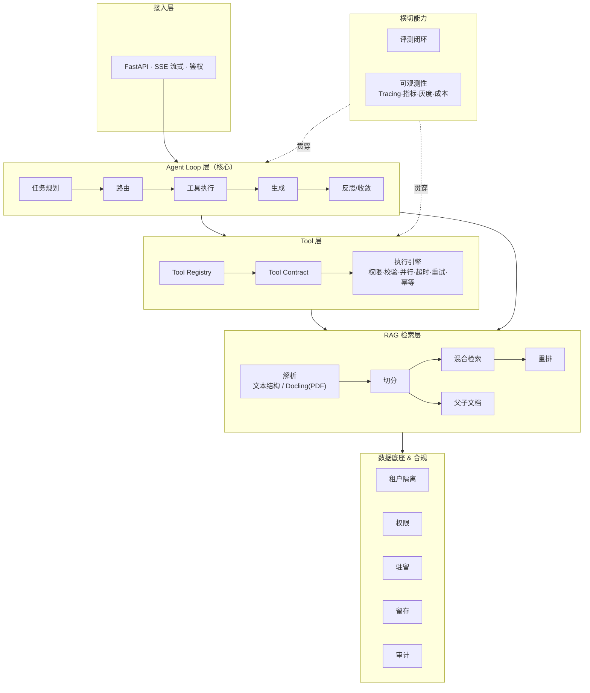
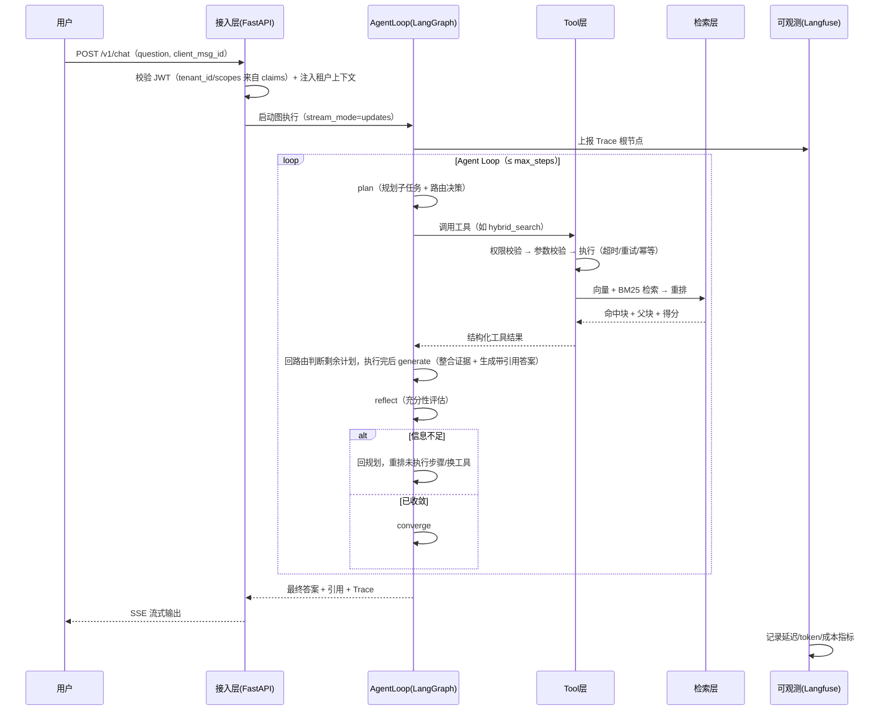
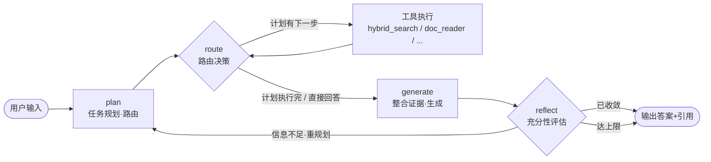
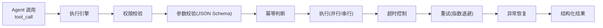
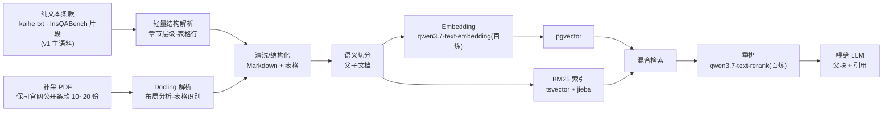
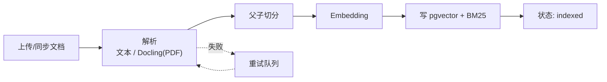
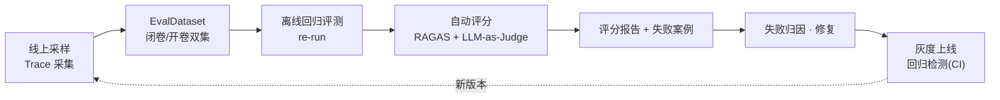
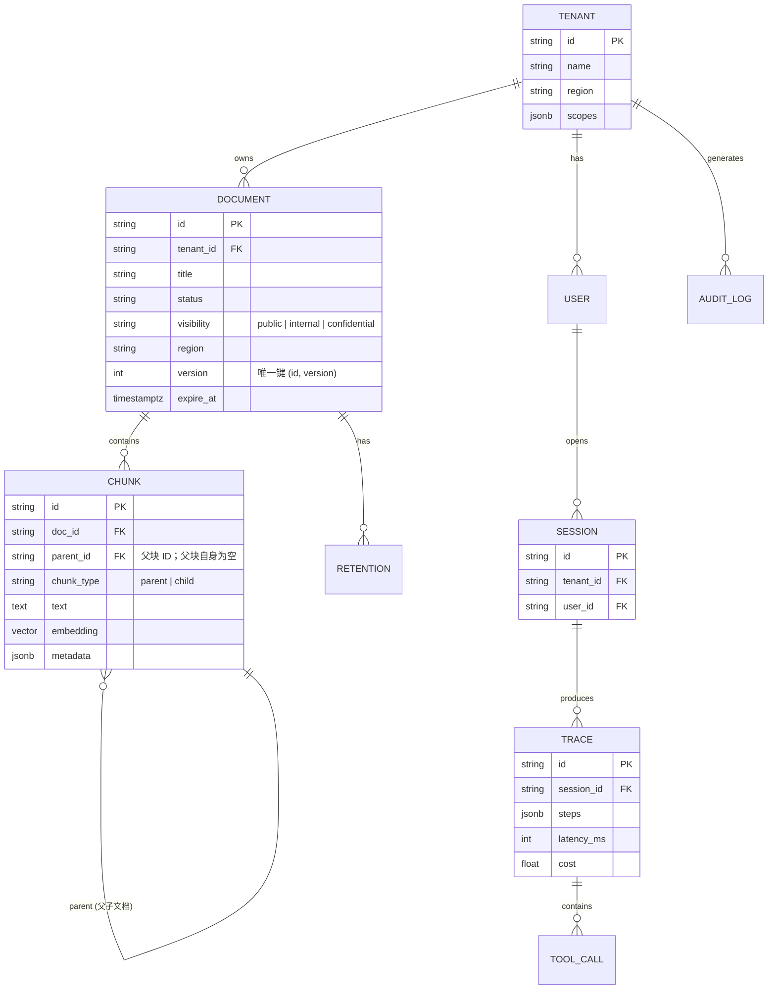
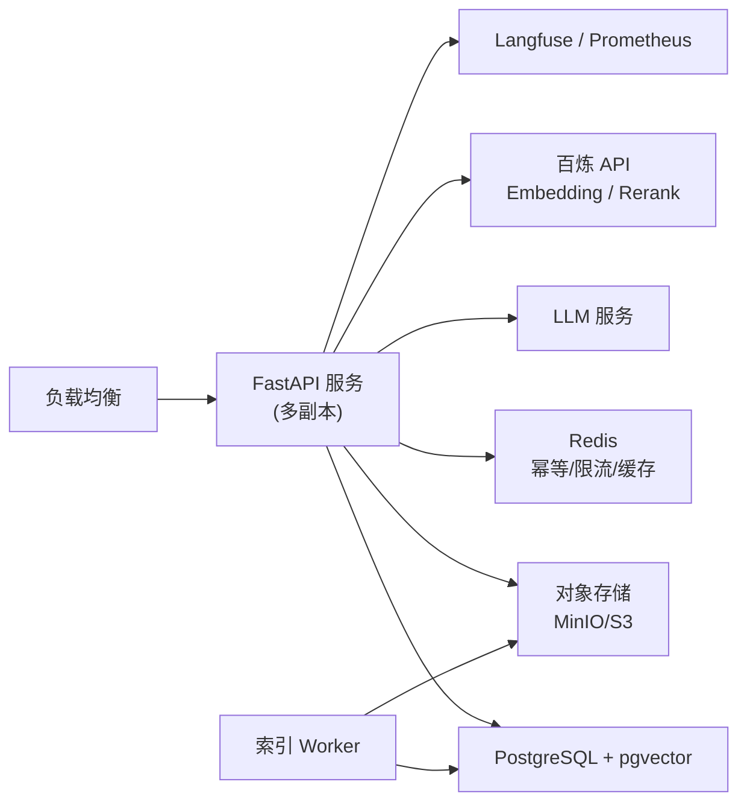

# AtlasRAG — 生产级 Agentic RAG 平台 · 架构设计文档

> 以「知识检索」场景为切入点，用 AgentLoop 作为大脑、可插拔 Tool 层承载能力、评测闭环与可观测保证质量，最终把 Agent 从 Demo 稳定交付到真实产品。

## 一句话定位

AtlasRAG 是一个以**保险知识库智能问答**为首个场景的**生产级 Agentic RAG 平台**，核心不是「检索 + 生成」的固定流水线，而是一个**能自愈、可评测、可灰度、可审计的知识检索 Agent**。

## 为什么做这个项目

它面向「AI Agent 资深工程师」岗位 JD 的全部主线要求：

| JD 主线要求 | 本文档对应章节 |
|---|---|
| 场景闭环（用户输入 → 最终产出） | 01 · 02 |
| 生产级 AgentLoop（规划/状态/上下文/工具编排/收敛） | 03 |
| Tool Registry / Contract / Function Calling / MCP | 04 |
| RAG、向量检索、Docling、父子文档 | 05 |
| 评测闭环（EvalDataset / Replay / RAGAS / Judge / 回归） | 06 |
| 生产质量（Tracing / 指标 / 灰度 / 回滚 / 成本） | 06 |
| 数据底座、权限、租户隔离、驻留、留存、审计 | 07 |
| 服务接口、数据模型、代码工程结构 | 08 |
| 里程碑路线图与验收标准 | 09 |

## 文档目录

| 文档 | 内容 |
|---|---|
| [01-项目概述与JD覆盖矩阵](01-项目概述与JD覆盖矩阵.md) | 背景、定位、设计原则、JD 逐条映射、范围与非目标 |
| [02-总体架构](02-总体架构.md) | 六层架构、技术选型、关键设计决策（ADR）、请求生命周期 |
| [03-AgentLoop详细设计](03-AgentLoop详细设计.md) | 状态机、State Schema、各节点设计、收敛策略、上下文管理 |
| [04-Tool层设计](04-Tool层设计.md) | Tool Registry、Contract、执行引擎、MCP、内置工具清单 |
| [05-RAG数据管道设计](05-RAG数据管道设计.md) | Docling 解析、切分、混合检索、重排、父子文档、索引流水线 |
| [06-评测闭环与生产质量](06-评测闭环与生产质量.md) | EvalDataset、Replay、RAGAS/Judge、Tracing、灰度、成本 |
| [07-数据底座合规与数据模型](07-数据底座合规与数据模型.md) | 租户隔离、权限、驻留、留存、审计、表结构、ER |
| [08-API与代码目录结构](08-API与代码目录结构.md) | REST/SSE 接口契约、代码目录、配置、部署拓扑 |
| [09-里程碑路线图与验收标准](09-里程碑路线图与验收标准.md) | 六阶段路线图、每阶段交付物与验收、取舍与风险 |

> 本目录是**唯一事实源**。根目录的 `AtlasRAG-架构设计文档.md` 为脚本生成的合并产物（`python3 scripts/build_combined_doc.py`），仅供单文件分享，**勿手改**。阶段 0 数据成果见 [`data/README.md`](../data/README.md)。

## 快速导读

- **只想了解全貌** → 先读 01、02，再看 09 的路线图。
- **想深入 Agent 内核** → 读 03（AgentLoop）和 04（Tool 层）。
- **想深入检索质量** → 读 05（RAG 管道）。
- **想体现工程深度** → 读 06（评测 + 生产质量）和 07（合规）。

## 技术栈速览

| 模块 | 选型 |
|---|---|
| Agent Runtime | LangGraph（Python） |
| 服务框架 | FastAPI + SSE 流式 |
| 文档解析 | Docling（布局分析 + 表格识别） |
| 向量库 | pgvector（或 Qdrant） |
| Embedding / 重排 | 百炼 qwen3.7-text-embedding / qwen3.7-text-rerank |
| 混合检索 | 向量 + BM25（Postgres tsvector）+ 重排 |
| 评测 | RAGAS + 自研 LLM-as-Judge |
| 可观测 | Langfuse（Tracing / 指标 / 成本） |
| LLM | 可插拔，默认 Qwen（qwen3.7-flash / qwen3.7-max） |

# 01 · 项目概述与 JD 覆盖矩阵

## 1.1 背景与动机

「AI Agent 资深工程师」的岗位 JD 有一个隐含前提：**不满足于能做 Demo，而是能把 Agent 稳定交付到真实产品。** 普通的 RAG 演示（load → embed → retrieve → prompt → answer）只覆盖了「知识检索」四个字，无法证明以下能力：

- AgentLoop 的任务规划、状态管理、工具编排、任务收敛；
- 工具的权限、参数校验、并行、超时、重试、幂等、异常恢复；
- 效果评测闭环与失败归因、回归检测；
- Tracing、灰度发布、回滚、延迟与成本监控；
- 数据权限、租户隔离、数据驻留、留存删除与审计。

AtlasRAG 的设计目标，就是用一个**小而完整**的项目，把以上能力逐条做实、可演示、可评测。

## 1.2 项目定位

| 维度 | 说明 |
|---|---|
| 名称 | AtlasRAG（Atlas = 知识地图，隐含「承载与导航」） |
| 首个场景 | 保险知识库智能问答（贴合 insurance_db 业务延伸） |
| 本质 | 生产级 Agentic RAG 平台 |
| 核心范式 | **检索是 Agent 可随时调用的一个工具，而非前置步骤** |
| 交付形态 | 可运行的服务 + 离线索引流水线 + 评测流水线 + 可观测面板 |

## 1.3 核心设计原则

1. **检索工具化（Retrieval-as-a-Tool）**：检索不再是流水线中的固定一步，而是 Agent 在 Plan/Reflect 阶段可以自主决定「是否检索、检索几次、换不换关键词」的工具。这是 Agentic RAG 与普通 RAG 的分水岭。
2. **一切皆可评测**：任何代码改动都应能通过离线回归评测（re-run）产出分数涨跌，杜绝「感觉变好了」。
3. **工具健壮性是中间件**：权限、校验、并行、超时、重试、幂等、异常恢复做成可复用的执行引擎，而不是散落在每个工具里。
4. **收敛优先于聪明**：Agent 循环必须有 max_steps、超时、充分性判据三重保险，先保证「一定会停下来」。
5. **可演进优于一次性正确**：模块间通过 Contract 解耦，允许模型、向量库、LLM 随时替换。

## 1.4 JD 覆盖矩阵

### 岗位职责逐条映射

| JD 岗位职责 | AtlasRAG 落地 | 证据/章节 |
|---|---|---|
| 1. 至少一个 AI 场景端到端闭环（知识检索） | 保险知识库问答：文档 → 索引 → 检索 → Agent 编排 → 带引用答案 | 02 · 05 |
| 2. 生产级 AgentLoop（规划/状态/上下文/多轮/工具编排/收敛） | LangGraph 状态机：plan → route → tool → generate → reflect → converge | 03 |
| 3. Tool Registry / Contract / Function Calling / MCP（权限/校验/并行/超时/重试/幂等/异常恢复） | Tool 层三件套 + 执行引擎中间件 + MCP 客户端 | 04 |
| 4. 评测闭环（EvalDataset/离线 Replay/自动评分/LLM-as-Judge/失败分析/回归） | 评测流水线 + 分层 CI 门禁（确定性指标全量 + 生成评测抽样） | 06 |
| 5. 生产质量（Tracing/日志指标/版本/灰度/回滚/延迟成本监控） | 可观测层 + 发布策略 | 06 |
| 6. 跨团队协作、原型 → 真实产品 | 阶段化路线图 + 验收标准 + 部署拓扑 | 09 |

### 任职要求逐条映射

| JD 任职要求 | AtlasRAG 落地 |
|---|---|
| 1. LLM/Agent 真实场景，非 Demo | 保险真实条款语料（InsQABench + kaihe，见 `data/README.md`）+ 闭卷/开卷双评测集 + 线上采样 |
| 2. LangGraph / Agent Runtime（状态/工具调用/检查点/恢复/可观测） | LangGraph checkpoint + 恢复 + 可观测 |
| 3. Tool Calling 关键问题（上下文压缩/编排/并行/幂等/超时/重试/异常） | Tool 层 + 上下文管理 |
| 4. 效果优化（数据集/指标/实验方法/定位问题） | 闭卷/开卷双评测集 + RAGAS 四指标 + 失败归因四象限 |
| 5. 主流语言、清晰可靠可演进的服务接口 | Python + FastAPI + Contract 解耦 |
| 6. 效果/可靠性/延迟/成本/权限之间取舍 | 渐进式检索策略 + 成本预算 |

### 加分项映射

| 加分项 | AtlasRAG 落地 |
|---|---|
| Agent Runtime / SDK / MCP / RAG / 向量检索 / Observability | 全栈覆盖 |
| LLM Evaluation / 自动评分 / 离线 Replay / 线上监控 | 06 |
| Canvas / 文档编辑 / 图形渲染 / 多模态 / 内容结构化 | Docling 解析补采的真实条款 PDF（表格结构识别 → 结构化输出）；v1 主语料为纯文本，PDF 为补采演示，多模态留作演进 |
| 数据权限 / 租户隔离 / 数据驻留 / 留存删除 | 07 |

## 1.5 范围与非目标（Scope & Non-goals）

**范围内（In scope）**
- 单场景（保险知识库）端到端问答闭环；
- AgentLoop 状态机 + 多轮对话 + 工具编排；
- 混合检索 + 重排 + 父子文档检索；
- 评测闭环 + 可观测 + 灰度发布；
- 租户隔离与审计的**最小可演示**实现。

**非目标（Non-goals，避免范围蔓延）**
- 不实现多模态问答、语音、图片理解（留作阶段演进）；
- 不实现自研向量引擎或 LLM（复用成熟组件）；
- 不实现完整的 RBAC/单点登录体系（只做租户隔离与权限的接入规范）；
- 不追求「通用智能体」，聚焦「知识检索 Agent」这一垂直场景做到极致。

## 1.6 术语表

| 术语 | 含义 |
|---|---|
| AgentLoop | Agent 的「感知-规划-执行-反思-收敛」循环 |
| State Schema | Agent 在循环中携带的共享状态定义 |
| Tool Contract | 工具的输入/输出 JSON Schema 契约 |
| scope（权限域） | 工具级权限声明（如 `retrieval:read`），来自 JWT claims |
| visibility（密级） | 文档级可见性（public/internal/confidential），与权限域 scope 区分 |
| 混合检索 | 向量检索 + 关键词检索（BM25）结果融合 |
| 父子文档 | 用小块检索、用父块喂给 LLM 以保留上下文；父块独立成行，子块 `parent_id` 关联 |
| RAGAS | 一套 RAG 效果评测框架（忠实度/相关性/召回等） |
| LLM-as-Judge | 用 LLM 给生成结果打分，替代人工标注 |
| 闭卷集 / 开卷集 | 闭卷 = 不给证据片段测检索召回（kaihe）；开卷 = 自带证据片段测生成与引用（InsQABench） |
| 回归评测（re-run） | 同一评测 query 在新版本上重新执行，对比效果涨跌；区别于「真回放」（录制响应原样重放，只验证编排，v1 不做） |
| Evidence / Citations / tool_results | 工具原始返回 ⊇ 进入生成上下文的证据池 ⊇ 答案实际引用子集 |
| 熔断线 | 超时/预算触发的强制降级输出线，不是延迟承诺值 |

# 02 · 总体架构

## 2.1 六层架构 + 横切能力



### 各层职责

| 层 | 职责 | 关键组件 |
|---|---|---|
| 接入层 | 统一入口、鉴权、SSE 流式、多端适配 | FastAPI、鉴权中间件、会话管理 |
| Agent Loop 层 | 大脑：规划、路由、编排工具、反思、收敛 | LangGraph 图、State、checkpoint |
| Tool 层 | 手脚：注册、契约、执行健壮性 | Registry、Contract、执行引擎、MCP 客户端 |
| RAG 检索层 | 感官：解析、索引、检索、重排 | 结构解析/Docling、切分器、pgvector、tsvector BM25、reranker |
| 数据底座 & 合规 | 地基：隔离、权限、驻留、留存、审计 | 租户上下文、权限过滤器、审计日志 |
| 横切能力 | 质量：评测、Tracing、指标、灰度、成本 | Eval 流水线、Langfuse、发布器 |

**核心设计点**：检索层（L4）不直接接到 Agent Loop 的「必经之路」上，而是以「工具」的身份注册进 Tool 层（L3）。Agent 可以选择不用检索、用一次、或用多次。

## 2.2 技术选型总览

| 模块 | 选型 | 理由 | 备选 |
|---|---|---|---|
| Agent Runtime | **LangGraph** | 原生支持状态机、检查点、恢复、可观测，最贴任职要求 | OpenAI Agents SDK、自研 |
| 语言 | **Python 3.12** | LangGraph 生态最完整；作者正在学 | TypeScript/Go（服务层可选） |
| 服务框架 | **FastAPI** | 异步、SSE 流式友好；作者已有经验 | —— |
| 文档解析 | **轻量文本结构解析 + Docling** | v1 主语料为纯文本条款（kaihe/InsQABench）；Docling 用于补采的真实条款 PDF（布局分析 + 表格结构识别） | Unstructured、PyMuPDF |
| 向量库 | **pgvector** | 复用数据库运维经验、事务一致、免额外服务 | Qdrant、Milvus |
| 关键词检索 | **BM25**（Postgres `tsvector` + jieba 预分词） | 中文召回补全，与向量同库一条 SQL、零额外服务；演进项 ParadeDB pg_search | Elasticsearch（运维重，排除） |
| 重排 | **qwen3.7-text-rerank**（百炼 API） | 与 Embedding/LLM 同供应商、免 GPU 运维、中文效果好；接口抽象可切换 | bge-reranker 本地部署（降级/演进）、Cohere rerank |
| 评测 | **RAGAS + 自研 Judge** | 忠实度/相关性/召回四指标 + 定制评分 | LlamaIndex eval |
| 可观测 | **Langfuse** | 开源，Tracing/指标/成本一体 | LangSmith、自研 OTEL |
| LLM | 可插拔，默认 **qwen3.7-flash（简单）/ qwen3.7-max（复杂）** | 成本低、中文强、原生 function calling，与阶段 0 QA 生成同源 | GPT、Claude；DeepSeek R1 类仅作离线 Judge 候选（需验证 tool-call 支持） |
| Embedding | **qwen3.7-text-embedding**（百炼 API） | 与 LLM/重排同供应商（百炼），中文检索效果好；维度建库时固定（2560/1024/768 等档位），换模型需全量重建索引，v1 定死一个 | bge-m3（开源自建）、text-embedding-v3 |
| 缓存 | Redis | 幂等键、限流、会话 | —— |
| 对象存储 | MinIO / S3 | 原始文档驻留 | 本地磁盘（开发期） |

## 2.3 关键设计决策（ADR 摘要）

### ADR-001：检索工具化，而非流水线化

- **决策**：检索以 Tool 身份进入 Tool Registry，由 Agent 决策调用。
- **理由**：复杂问题需要多轮检索、改写 query、切换关键词，固定流水线无法满足；工具化也天然复用执行引擎的健壮性能力。
- **代价**：增加了延迟与 token 成本，需要渐进式策略与预算控制（见 03）。

### ADR-002：用 LangGraph 而非自研 Runtime

- **决策**：基于 LangGraph 构建，状态管理与检查点交给框架。
- **理由**：自研 Runtime 成本高、易出 bug；LangGraph 的 checkpoint/恢复/可观测是 JD 明确要求的能力，直接用成熟实现并吃透其机制，比「重新发明」更有说服力。
- **代价**：框架学习曲线与版本兼容性（JD 职责边界里「版本兼容」正是要解决的问题）。

### ADR-003：混合检索 + 重排，而非纯向量

- **决策**：向量（语义召回）+ BM25（精确关键词召回）→ 融合 → 重排。
- **理由**：保险条款里大量专有名词/编号（如「等待期」「免赔额」「第 X 条」），纯向量易漏，BM25 补召回，重排提精度。

### ADR-004：父子文档检索

- **决策**：小块做向量索引与召回，命中后返回**父块**（完整段落/小节）喂给 LLM。
- **理由**：避免切分后上下文丢失，兼顾「检索精度」与「生成上下文完整性」。

### ADR-005：评测门禁进 CI

- **决策**：任何影响检索/生成的改动，CI 必须跑离线回归评测 + RAGAS 评分，低于基线即阻断合并。
- **理由**：把「效果不会退化」变成工程约束，而非口头承诺。

### ADR-006：AgentLoop 计划逐步执行，而非每个工具后都生成反思

- **决策**：`tool_node` 执行完回到 `route` 判断剩余计划；`generate`/`reflect` 只在计划执行完（或直接回答）后运行；reflect 增加 `continue_plan`，回环重规划只替换未执行步骤。
- **理由**：避免每个工具后都生成草稿导致 token 成本随步骤数翻倍；消除「剩余计划步骤执行不到、`current_step` 回环清零」的控制流缺陷。
- **代价**：反思粒度变粗，中途工具失败靠失败标记 + 重规划兜底（见 03）。

### ADR-007：评测门禁分层，而非全量进 CI

- **决策**：PR 只跑闭卷集**确定性检索指标全量**（无 LLM）+ 生成评测**分层抽样**（100~200 条，temp=0）；nightly/发布前跑全量；阈值 = 基线 ±2σ（实测 run-to-run 方差）。
- **理由**：~2000 条 QA 全量生成 + LLM Judge 每次 PR 跑不起；LLM 噪声下固定百分比阈值会随机误杀合并。
- **代价**：抽样可能漏掉小样本回归 → 靠 nightly 全量兜底。

### ADR-008：BM25 落在 Postgres 内

- **决策**：写入时 jieba 预分词 → `tsvector`（simple）列 + GIN 索引，与 pgvector 同库。
- **理由**：零额外服务，贴合单机 Docker Compose；向量与关键词一条 SQL 混查。
- **代价**：BM25 分数为近似（`ts_rank`）；需要原生 BM25 分数时演进到 ParadeDB pg_search。

### ADR-009：租户身份来自 JWT，而非请求体

- **决策**：自签 JWT，`tenant_id`/`scopes`/`roles` 作为 claims；请求体不接收 `tenant_id`。
- **理由**：`tenant_id` 由客户端传入等于允许冒充任意租户，租户隔离从入口即失效。
- **代价**：需要 token 签发与校验中间件；OIDC 单点登录留作演进。

## 2.4 端到端请求生命周期



## 2.5 非功能需求（NFR）

延迟按路径分级承诺（寒暄走规则 fast-path 不进 LLM；L0 = 简单事实，L1/L3 = 需理解/计算的复杂问题，难度定义见 06）：

| 类别 | 目标 |
|---|---|
| 延迟（寒暄） | 规则 fast-path 直答，首 token P95 < 1s |
| 延迟（L0 直答路径） | 首 token P95 ≤ 2.5s；总时长 P95 ≤ 8s |
| 延迟（L1/L3 完整 Loop） | 总时长 P95 ≤ 30s；20s 为**熔断线**（触发降级输出），不是承诺值 |
| 可靠性 | Agent 循环必须收敛；工具调用有超时/重试/幂等 |
| 成本 | 单次问答 token 预算上限（**含 reasoning tokens**）；缓存命中可跳过重算 |
| 安全 | 租户身份来自 JWT claims；租户数据隔离；权限过滤；敏感字段脱敏 |
| 合规 | 数据驻留可配置；留存到期自动删除；全程审计 |
| 可观测 | 100% 请求有 Trace；关键指标有仪表盘与告警 |
| 可评测 | PR 分层门禁 + nightly 全量回归（见 06），低于基线 ±2σ 阻断 |

# 03 · AgentLoop 详细设计

> 对应 JD「生产级 AgentLoop：任务规划、状态管理、上下文管理、多轮交互、工具编排、任务收敛」。

## 3.1 设计目标

1. **可规划**：能把复杂问题拆成子任务，决定检索/工具/直接回答的路径。
2. **可反思**：检索结果不充分时能主动补检索、换关键词、换工具。
3. **必收敛**：任何输入都能在有限步内停下来（max_steps + 超时 + 充分性判据）。
4. **可恢复**：任意节点失败或进程重启后，能从检查点续跑。
5. **可观测**：每一步决策、每次工具调用都有 Trace。

## 3.2 状态机总览



> 说明：路由决策可以内聚在 `plan` 节点里，也可以独立成 `route` 节点。文档采用「plan 产出计划、route 按计划逐步调度工具、reflect 决定是否回环」的三段式，职责清晰、便于测试。
>
> **循环粒度**：`tool_node` 执行完**回到 route** 判断剩余计划；`generate`/`reflect` 只在计划执行完（或 route=直接回答）后运行一次——不在每个工具后都生成草稿，避免 token 成本随步骤数翻倍。

## 3.3 State Schema（共享状态定义）

这是整个 AgentLoop 的「血液」，LangGraph 用它在节点间传递、并用它做检查点。

```python
from typing import TypedDict, Annotated, Literal, Any
import operator
from langgraph.graph.message import add_messages
from langchain_core.messages import BaseMessage

class AgentState(TypedDict, total=False):
    # —— 消息与多轮 ——
    messages: Annotated[list[BaseMessage], add_messages]   # 对话历史（增量合并）

    # —— 任务规划 ——
    plan: list[dict]                     # [{"step": 1, "action": "retrieve", "query": "...", "tool": "hybrid_search"}]
    current_step: int                    # 当前执行到第几步；回环重规划时保留，只替换未执行步骤
    route: Literal["retrieve", "answer"]          # 路由决策（plan 产出，route 节点据此调度）

    # —— 检索/工具证据 ——
    evidence: list[dict]                 # 进入生成上下文的证据池 [{tool, result, score, source}]
    tool_results: Annotated[list[dict], operator.add]  # 工具原始返回（append-only，调试/审计）

    # —— 生成与收敛 ——
    draft: str                           # 当前草稿答案
    reflect: dict                        # {"sufficient": bool, "reason": str, "next_action": str}
    final_answer: str                    # 最终答案
    citations: list[dict]                # 引用 [{doc_id, chunk_id, text}]

    # —— 控制与治理 ——
    steps: int                           # 已执行步数（收敛计数）
    max_steps: int                       # 步数上限
    budget: dict                         # {"tokens_used": int, "token_limit": int, "cost": float}
    tenant_id: str                       # 租户上下文（来自 JWT claims，贯穿权限过滤）
```

**关键点**：`messages` 和 `tool_results` 都用**追加型 reducer** 做增量合并——`add_messages` 是为对话消息设计的（按消息 ID 合并），工具结果是普通 dict，用 `operator.add` 即可。每次循环只追加、不重写，天然适合多轮和检查点恢复。中断/恢复直接用 LangGraph 原生 `interrupt()` + `checkpointer`，State 里不需要手工的中断标记。

**三个证据字段的边界**（含关系 `tool_results ⊇ evidence ⊇ citations`）：

| 字段 | 定义 | 用途 |
|---|---|---|
| `tool_results` | 工具的**原始返回**，append-only | 调试、审计、失败归因 |
| `evidence` | 从 tool_results 筛出、**进入生成上下文**的证据（父块文本 + 来源 + 得分） | generate 的输入 |
| `citations` | 答案**实际引用**的 evidence 子集 | 前端溯源、引用评分 |

## 3.4 各节点详细设计

### 3.4.1 plan（任务规划）

- **职责**：把用户问题拆成可执行计划；决定路由；对检索类任务做 query 改写（中文口语 → 检索友好）。
- **输入**：`messages`（历史）、`tenant_id`。
- **输出**：`plan`（子任务列表）、`route`；首次进入时 `current_step=0`，反思回环重规划时**保留 `current_step`、只替换未执行步骤**（已执行的计划与证据不丢）。
- **LLM Prompt 要点**：
  - 「你是保险知识库的检索规划器。判断问题是否需要检索：寒暄/纯常识 → answer；专业条款 → retrieve。」
  - 「需要检索时，输出 query 改写（把『这个保险能不能赔』改写成『理赔范围 条款』）和子任务列表。」
  - 用 **structured output（JSON Schema）** 约束输出，避免解析失败。

```python
class PlanResult(BaseModel):
    route: Literal["retrieve", "answer"]
    plan: list[PlanStep]

class PlanStep(BaseModel):
    step: int
    action: Literal["retrieve", "tool"]
    tool: str                      # 工具名
    query: str                     # 已改写的检索 query
    rationale: str                 # 为什么这样做
```

### 3.4.2 route（路由调度）

- **职责**：根据 `plan[current_step]` 决定下一步——调用哪个工具、还是进入生成；`tool_node` 执行完后回到本节点，判断计划是否还有剩余步骤。
- **逻辑**：纯确定性逻辑（无 LLM），保证可测试、可预测。
- **规则**：
  - `route == "answer"` → 进入 `generate`；
  - 计划未执行完 → 取 `plan[current_step].tool` 进入 `tool_node`；
  - 计划已执行完 → 进入 `generate`。

### 3.4.3 tool_node（工具执行）

- **职责**：把 `plan[current_step]` 转成一次工具调用，交给 Tool 层执行（见 04），结果写入 `tool_results` 与 `evidence`。
- **并行调用**：同一步若有多个独立工具调用，Tool 层并行执行、结果合并。
- **失败处理**：工具抛异常 → 记录到 `evidence`（标记 failed），由 `reflect` 决定是否换工具/换关键词，而非直接中断。

### 3.4.4 generate（生成）

- **职责**：基于 `evidence` 整合证据，生成**带引用**的答案草稿。
- **输入**：`evidence`（含父块文本 + 来源）、`messages`。
- **输出**：`draft`、`citations`。
- **Prompt 要点**：
  - 「只依据提供的资料回答，资料不足时明确说『资料不足』，禁止编造。」
  - 「每个结论后标注引用编号 [1][2]。」
- **引用格式**：`citations` 用 `{doc_id, chunk_id, text, score}` 结构化返回，前端可点击溯源。

### 3.4.5 reflect（反思与收敛）

- **职责**：评估草稿是否充分，决定「输出 / 继续执行计划 / 回环重规划 / 达上限强制输出」。
- **充分性判据**（LLM 打分 + 硬规则）：
  - 硬规则（确定性）：`steps >= max_steps` → 强制收敛；`budget.tokens_used >= token_limit` → 强制收敛；证据为空且已尝试 ≥ 2 次 → 输出「资料不足」。
  - LLM 判据：证据是否覆盖问题所有子任务、草稿是否自洽、是否有幻觉风险。

```python
class ReflectResult(BaseModel):
    sufficient: bool
    reason: str
    next_action: Literal["converge", "continue_plan", "retrieve_more", "rewrite_query", "switch_tool"]
    next_query: str | None
```

> `continue_plan`：计划还有剩余步骤时直接回 route 继续执行（不过 LLM 重规划）；`retrieve_more` / `rewrite_query` / `switch_tool` 回 plan **只重排未执行步骤**。

### 3.4.6 converge（收敛输出）

- **职责**：确定 `final_answer`，组装引用，结束循环，上报完整 Trace。

## 3.5 收敛策略（三重保险）

| 保险 | 机制 | 默认值 |
|---|---|---|
| 步数上限 | `steps >= max_steps` 强制收敛 | 6 |
| 超时 | 整个图执行 wall-clock 超时 | 20s |
| 成本预算 | token 预算耗尽即收敛 | 8000 token |

**渐进式检索策略**（权衡延迟/成本/效果的核心）：
1. 第一轮：plan 产出完整计划（可含多个检索步骤）→ route 逐步执行 → 生成 → 反思；
2. 若不足：回环 plan 重规划（改写 query / 换工具 / 补检索，**只替换未执行步骤**）→ 第二轮；
3. 若仍不足且未超预算：第三轮（最多）→ 无论如何收敛，输出「已尽力 + 资料不足提示」。

> 效果 > 延迟的深层问题通常不值得无限循环，3 次检索 + 硬上限是「确定性交付」的务实选择。

## 3.6 上下文管理与多轮对话

| 手段 | 用途 | 触发条件 |
|---|---|---|
| 滑动窗口 | 只保留最近 N 轮消息 | 始终 |
| 摘要压缩 | 长对话压缩历史为摘要 | 历史 token 超过阈值（如 3000） |
| 证据链保留 | 摘要时**保留引用与结论**，不丢关键证据 | 压缩时 |
| 会话记忆 | 跨轮记住用户身份/偏好/已确认事实 | 明确出现 |

**上下文压缩 vs 信息丢失**的平衡：摘要只压缩「对话过程」，**不压缩「已检索到的证据与结论」**——忠实度优先，宁可上下文长一点，也不丢溯源依据。

## 3.7 错误处理与恢复

- **节点级重试**：LLM 调用失败/超时 → 指数退避重试（最多 3 次）。
- **检查点恢复**：LangGraph 的 `checkpointer` 持久化 State，进程崩溃后从最后一个成功节点续跑（`interrupt()` / resume 由框架原生支持，人工或自动触发）。
- **优雅降级**：检索层故障 → 输出「服务暂不可用」并降级为「直接回答 + 明确提示」，不编造。

## 3.8 代码骨架

```python
from langgraph.graph import StateGraph, START, END
from langgraph.checkpoint.memory import MemorySaver

def build_graph(llm, tools, retriever):
    g = StateGraph(AgentState)

    g.add_node("plan", make_plan(llm))
    g.add_node("route", route)
    g.add_node("tool_node", ToolNode(tools))       # 复用 04 的执行引擎
    g.add_node("generate", generate(llm))
    g.add_node("reflect", reflect(llm))
    g.add_node("converge", converge)

    g.add_edge(START, "plan")
    g.add_edge("plan", "route")
    g.add_conditional_edges("route", route_fn, {
        "retrieve": "tool_node", "answer": "generate",
    })
    g.add_edge("tool_node", "route")   # 执行完回路由，判断剩余计划
    g.add_conditional_edges("reflect", reflect_fn, {
        "converge": "converge",
        "continue_plan": "route",     # 计划还有剩余步骤，直接继续
        "retrieve_more": "plan",      # 回环重规划（只替换未执行步骤）
        "rewrite_query": "plan",
        "switch_tool": "plan",
    })
    g.add_edge("generate", "reflect")
    g.add_edge("converge", END)

    return g.compile(checkpointer=MemorySaver())  # 生产换 PostgresSaver
```

> 生产环境将 `MemorySaver` 换成 `PostgresSaver`，检查点落库，实现真正的跨进程恢复与多副本部署。

# 04 · Tool 层设计

> 对应 JD「接入和演进 Tool Registry、Tool Contract、Function Calling 或 MCP，处理工具权限、参数校验、并行调用、超时、重试、幂等和异常恢复」。

## 4.1 设计目标

把「工具」抽象为三件套，让健壮性能力成为**可复用中间件**，而非散落在每个工具实现里：

1. **Tool Registry**：工具的统一注册与发现。
2. **Tool Contract**：用 JSON Schema 声明输入/输出，驱动校验与 LLM Function Calling。
3. **执行引擎（Executor）**：权限 → 校验 → 并行 → 超时 → 重试 → 幂等 → 异常恢复的统一执行管道。



## 4.2 Tool Contract（JSON Schema）

每个工具一份契约，同时服务三个目的：**LLM Function Calling 的 schema**、**参数校验**、**文档即代码**。

```python
from pydantic import BaseModel, Field

class VectorSearchInput(BaseModel):
    """向量检索工具输入契约"""
    query: str = Field(description="检索查询，应为检索友好的改写后 query")
    top_k: int = Field(default=5, ge=1, le=20, description="返回结果数量")
    filters: dict | None = Field(default=None, description="元数据过滤，如 {product: '重疾险'}")
    use_rerank: bool = Field(default=True)

class ToolContract(BaseModel):
    name: str
    description: str
    input_schema: dict          # VectorSearchInput.model_json_schema()
    output_schema: dict
    timeout_ms: int = 5000
    max_retries: int = 2
    idempotent: bool = True     # 是否幂等
    parallel_safe: bool = True  # 是否可并行
    required_scopes: list[str]  # 权限域（scope），如 ["retrieval:read"]；与文档密级 visibility（07）区分
```

- `output_schema` 在 v1 的用途是**文档 + structured output 约束**（生成侧 JSON Schema），不做工具返回值的强校验；强校验作为演进项。

契约同时会转换为 LLM 可用的 tools 定义：

```python
{
  "type": "function",
  "function": {
    "name": "hybrid_search",
    "description": "在保险知识库中做混合检索（向量+关键词+重排）",
    "parameters": VectorSearchInput.model_json_schema()
  }
}
```

## 4.3 执行引擎（健壮性中间件）

### 4.3.1 权限校验（Permission）

- 每个工具声明 `required_scopes`（**权限域**）；执行前校验 JWT claims 中的租户 scope 是否具备。
- 检索类工具额外注入**租户过滤器与密级（visibility）过滤**，从源头保证数据隔离（见 07）。

### 4.3.2 参数校验（Validation）

- 用 `input_schema` 做 Pydantic 校验，非法参数**在进入工具前**被拦截，返回结构化错误（而非让工具崩溃）。

### 4.3.3 并行调用（Parallel）

- 同一计划步骤里的多个独立工具，用 `asyncio.gather` 并行执行。
- `parallel_safe=False` 的工具（如写操作）串行执行，避免竞态。

### 4.3.4 超时（Timeout）

- 每个工具独立 `timeout_ms`，用 `asyncio.wait_for` 控制。
- 超时不杀进程，返回 `ToolTimeoutError`，交给上层（reflect）决定重试或降级。

### 4.3.5 重试（Retry）

- 仅对**可重试错误**（网络抖动、超时、5xx）做指数退避重试。
- 不可重试错误（参数非法、权限拒绝、4xx）直接失败，不浪费重试。

```python
def is_retryable(exc: Exception) -> bool:
    return isinstance(exc, (ToolTimeoutError, NetworkError, ServiceUnavailableError))
    # 参数非法、权限拒绝、资源不存在 → False
```

### 4.3.6 幂等（Idempotency）

- 写类工具（如「记录用户确认」）接受 `idempotency_key`，Redis 记录执行状态，重复请求返回首次结果，避免重试/重放造成副作用。
- **非幂等工具不参与重试**：超时后副作用状态未知（可能已写入），只能查询确认，不能盲目重发。
- 读类工具天然幂等，`idempotent=True` 仅作标注。

### 4.3.7 异常恢复（Recovery）

- 工具异常统一包装为 `ToolExecutionError`，携带 `tool_name`、`retried`、`duration`、`trace_id`。
- 执行引擎不吞异常，而是把失败结果写入 `evidence`（failed 标记），让 `reflect` 决策（换工具/换关键词/降级）。

## 4.4 MCP 接入

- 实现一个 **MCP Client**，把外部 MCP Server 提供的工具**动态注册**进 Tool Registry，与内置工具统一调度。
- 契约从 MCP 的 `tools/list` 与 JSON Schema 自动生成，无需手工维护。

```python
# 概念示意
from mcp import ClientSession

async def register_mcp_tools(registry: ToolRegistry, session: ClientSession):
    for tool in await session.list_tools():
        registry.register(
            name=f"mcp.{tool.name}",
            contract=ToolContract(
                name=tool.name,
                description=tool.description,
                input_schema=tool.inputSchema,
                output_schema={},
            ),
            handler=MCPServerTool(session, tool.name),
        )
```

> 这直接命中 JD 里「MCP」关键词，也体现「Tool Registry 可演进」的设计原则。

## 4.5 内置工具清单（首个场景）

| 工具 | 类型 | 说明 | LLM 可见 | 幂等 | 并行安全 |
|---|---|---|---|---|---|
| `hybrid_search` | 检索 | 向量 + BM25 融合 + 重排（主力检索工具，见 05） | ✅ | ✅ | ✅ |
| `doc_reader` | 读取 | 按 doc_id/chunk_id 精读父块 | ✅ | ✅ | ✅ |
| `sql_query` | 数据 | 查询结构化保单数据（只读） | 按场景 | ✅ | ✅ |
| `calculator` | 工具 | 保费/等待期计算 | 按场景 | ✅ | ✅ |
| `record_confirmation` | 写 | 记录用户对条款的确认 | 按场景 | ❌ | ❌ |
| `vector_search` / `bm25_search` | 检索 | hybrid 的内部路径，不单独暴露给 LLM | ❌（内部） | ✅ | ✅ |
| `web_search` | 检索 | **v1 移除**：与数据不出域（07）矛盾；如开通需租户显式授权 + region 策略，留作演进 | —— | —— | —— |

> **工具面收敛**：LLM 只见 `hybrid_search` + `doc_reader`（sql_query / calculator / record_confirmation 按场景加入）。三个检索工具全部暴露会让规划器在选择间抖动、产生重复检索；vector/bm25 作为 hybrid 的内部路径，仅当 reflect 判定关键词召回不足时按需升级暴露。

## 4.6 Tool Registry 代码骨架

```python
class ToolRegistry:
    def __init__(self):
        self._tools: dict[str, RegisteredTool] = {}

    def register(self, name, contract, handler): ...
    def get(self, name) -> RegisteredTool: ...
    def get_llm_schemas(self, scopes: list[str]) -> list[dict]:
        """按租户权限返回可用的 Function Calling schema"""
        return [t.contract.to_llm() for t in self._tools.values()
                if set(t.contract.required_scopes) <= set(scopes)]

    async def execute(self, call: ToolCall, ctx: ExecContext) -> ToolResult:
        tool = self.get(call.name)
        await self._guard.check_permission(tool, ctx)      # 权限
        args = self._guard.validate(tool, call.arguments)  # 校验
        return await self._executor.run(tool, args, ctx)   # 并行/超时/重试/幂等
```

> 设计要点：`get_llm_schemas(scopes)` 让**模型只能看到它有权调用的工具**，从源头实现「工具权限」的收敛。

# 05 · RAG 数据管道设计

> 对应 JD 加分项「RAG、向量检索」，并落地文档解析、父子文档检索、混合检索、重排。

## 5.1 管道总览



## 5.2 文档解析（轻量解析 + Docling）

- **v1 主语料是纯文本**（kaihe 完整条款 txt、InsQABench 证据片段，见 `data/README.md`），解析层用**轻量结构解析**：按「1 / 1.1 / 2.3.1」数字编号识别章节层级、按行识别表格，输出带结构元数据的 Markdown。
- **Docling 用于补采的真实 PDF**：从保司官网公开渠道采 10~20 份条款 PDF（清单见 `data/contract_fetch_list.csv`），专供「PDF → 布局分析 → 表格结构识别」链路的演示与表格召回抽查；主评测语料仍为纯文本。
- 两条路径输出统一为 **Markdown 中间格式**，带结构元数据（标题层级、表格、页码、区块类型）。

```python
# PDF 路径（补采语料）示意
from docling.document_converter import DocumentConverter

converter = DocumentConverter()
result = converter.convert("保单条款.pdf")
markdown = result.document.export_to_markdown()   # 结构化 Markdown
tables   = result.document.tables                  # 结构化表格对象
```

- **为什么要补 PDF + Docling**：保险条款有大量表格（保障责任表、费率表、等待期表），普通文本抽取会破坏结构，Docling 的表格识别能保留「行-列-单元格」语义，检索时可按表格单元格命中。

## 5.3 切分策略（父子文档）

- **子块（child chunk）**：小而精确，用于**向量索引与召回**。按语义边界（标题/段落/表格行）切分，约 300~500 token，重叠 10%。
- **父块（parent chunk）**：完整上下文，用于**喂给 LLM**。通常是一个完整小节、一张完整表格、或一个条款段落。
- **映射关系**：**父块独立成行存储**，子块通过 `parent_id` 关联；检索命中子块后按 `parent_id` 取父块文本。不在子块行冗余存父块全文，避免存储翻倍与更新不一致。

```python
class Chunk(BaseModel):
    chunk_id: str
    chunk_type: Literal["parent", "child"]
    parent_id: str | None     # 父块 ID；父块自身该字段为空
    text: str                 # 本块文本（父块=完整上下文；子块=用于向量化）
    metadata: dict            # {doc_id, title, section, page}
```

**父子文档为什么重要**：如果直接用小块喂 LLM，会因切分丢失上下文（一个条款的「除外责任」被切到前一块、正文在另一块）；用父块则保证答案有完整依据。这正是作者正在研究的「parent document retrieval」。

## 5.4 混合检索（Hybrid Retrieval）

- **向量检索**：语义召回，处理「理赔范围有哪些」这类自然语言。
- **BM25 关键词检索**：精确召回，处理「等待期 90 天」「免赔额 1 万」这类专有名词/编号。
- **融合**：RRF（Reciprocal Rank Fusion）融合两路结果，无需调权重、鲁棒。

```python
def rrf(results_a, results_b, k=60):
    scores = {}
    for rank, item in enumerate(results_a):
        scores[item.id] = scores.get(item.id, 0) + 1.0 / (k + rank + 1)
    for rank, item in enumerate(results_b):
        scores[item.id] = scores.get(item.id, 0) + 1.0 / (k + rank + 1)
    return sorted(scores.items(), key=lambda x: -x[1])
```

- 中文 BM25 需 **jieba 分词** + 自定义词典（保险术语：「免赔额」「等待期」「重疾」「轻症」）。
- **落地载体（ADR-008）**：Postgres 内做——写入时 jieba 预分词，分词结果以空格拼接经 `to_tsvector('simple', ...)` 存入 `tsvector` 列 + GIN 索引；与 pgvector 同库，混合检索一条 SQL、零额外服务。需要原生 BM25 分数时演进到 ParadeDB pg_search；不引入 Elasticsearch（运维重）。

## 5.5 重排（Rerank）

- 混合检索返回 top-50 候选，用百炼 **qwen3.7-text-rerank** 做精排，取 top-5。
- 重排模型做的是「query 与 doc 的深度语义相关性」，弥补向量检索「有召回但排序不准」的问题。
- **Serving**：纯 API 调用（百炼），无自建 reranker 服务；接口抽象保留，开源本地部署（如 bge-reranker，GPU/ONNX）作为降级与演进项。

```python
# 百炼 DashScope 调用示意
resp = rerank_client.rerank(
    model="qwen3.7-text-rerank",
    query=query,
    documents=[doc.text for doc in candidates],
    top_n=5,
)
```

## 5.6 向量库选型与索引

| 选型 | pgvector | 理由 |
|---|---|---|
| 存储 | PostgreSQL + pgvector 扩展 | 复用 DB 运维经验；向量与元数据同库，过滤与向量检索一条 SQL |
| 索引 | HNSW | 高召回 + 低延迟 |
| 租户隔离 | 每个 chunk 带 `tenant_id`，查询加 `WHERE tenant_id = ?` | 与 07 数据底座统一 |

```sql
-- 概念示意
CREATE INDEX ON chunks USING hnsw (embedding vector_cosine_ops)
  WHERE tenant_id IS NOT NULL;

SELECT c.chunk_id, p.text AS parent_text
FROM chunks c
JOIN chunks p ON p.chunk_id = c.parent_id      -- 父块独立成行
WHERE c.tenant_id = $1
ORDER BY c.embedding <=> $2::vector
LIMIT 50;
```

- **过滤条件与 HNSW 的召回退化**：pgvector 的索引扫描发生在过滤之前，`WHERE tenant_id = ...` 可能导致实际返回不足 top_k。对策：pgvector ≥ 0.8 开启迭代扫描（`hnsw.iterative_scan`）并调高 `hnsw.ef_search`，或一次取超采样候选再过滤；单租户数据量极大时演进为按租户分区。
- **维度与换模**：embedding 列维度在**建库时固定**（qwen3.7-text-embedding 支持 2560/1024/768 等档位，以百炼文档为准），更换 embedding 模型或维度 = 全量重建索引，故 embedding 模型版本与文档版本一起纳入缓存键（见 06.9）。

## 5.7 离线索引流水线

- 与在线服务解耦的**异步任务**（Celery / RQ / FastAPI BackgroundTask）。
- 流程：监听新文档 → 解析（文本轻量解析 / Docling-PDF）→ 切分 → 生成父子块 → embedding → 写 pgvector + BM25（tsvector）索引 → 更新文档状态 → 上报指标。
- **幂等**：以 `doc_id + version` 为键（`DOCUMENT` 表含 `version` 列，见 07.7），重复触发不重复入库。
- **失败恢复**：每个文档一条任务记录，失败可重放。



## 5.8 检索质量的关键取舍

| 问题 | 手段 |
|---|---|
| 召回不足（漏） | BM25 补精确召回 + query 改写（Agent 里做） |
| 排序不准（乱） | reranker 精排 |
| 上下文丢失（断） | 父子文档 |
| 表格理解差（碎） | Docling 表格结构识别 |
| 中文分词差 | jieba + 保险术语自定义词典 |

# 06 · 评测闭环与生产质量

> 对应 JD「建立 Agent 效果评测闭环」与「建设生产质量能力」。

## 6.1 评测闭环总览



核心思想：**改一行代码，都能看到分数涨跌**——把「效果不会退化」变成 CI 里的硬门禁，而非口头承诺。

## 6.2 EvalDataset（评测数据集）

- 三层结构：**Golden Set**（标准答案）+ **Sampled Set**（线上真实 query 采样）+ **Adversarial Set**（对抗/边界用例）。
- **与实际数据的映射**（阶段 0 已完成，来源与限制详见 `data/README.md`）：

| 评测集 | 数据 | 评测目标 |
|---|---|---|
| 闭卷集（检索） | kaihe 完整条款 102 份 + 生成 QA 985 条 + L4 拒答题 51 条 | **检索召回**（不给证据片段，真检索） |
| 开卷集（生成） | InsQABench 1060 条（自带证据片段） | **生成质量 + 引用忠实度** |
| Adversarial | L4 拒答题 51 条；L2 多跳待补、难度标签待复核 | 拒答边界 / 幻觉 |

```json
{
  "id": "eval-0001",
  "question": "这款重疾险的等待期是多少天？",
  "gold_answer": "等待期为 90 天，自合同生效日起算。",
  "source_docs": ["doc_rzx_2024.pdf"],
  "ground_truth_chunks": ["chunk-xxx"],
  "type": "factual",
  "tags": ["等待期", "重疾险"],
  "difficulty": "easy"
}
```

## 6.3 离线回归评测（re-run）

- **re-run（本项目采用）**：同一评测 query 在新版代码/配置上**重新执行**，对比新旧版本在「检索命中、工具选择、最终答案、延迟、成本」上的差异。LLM 是被测变量，必须真跑才能测出 prompt/模型变更的效果；评测统一 temp=0 + 固定检索参数，压低 run-to-run 方差（阈值口径见 6.6）。
- **真回放（record & replay，v1 不做）**：录制 LLM/工具响应后原样重放，只能验证**编排代码**的行为一致性，测不出 LLM 侧变化。Trace 落库（query + 各节点决策 + 工具调用 + 中间结果）的定位是**调试与线上采样数据源**，不做回放源。
- 关键价值：不依赖真实用户就能做**效果回归**。

```python
# 概念：重新执行一个评测 query，产出可对比的执行轨迹
async def rerun(request: ReplayRequest) -> ReplayTrace:
    trace = await agent.run(request.question, tenant_id=request.tenant_id)
    return ReplayTrace(
        question=request.question,
        steps=trace.steps,          # 每步：节点名、决策、工具、耗时、token
        final_answer=trace.final_answer,
        latency_ms=trace.latency_ms,
        cost=trace.cost,
    )
```

## 6.4 自动评分（RAGAS + LLM-as-Judge）

### RAGAS 四指标

| 指标 | 含义 | 回答的问题 |
|---|---|---|
| Faithfulness（忠实度） | 答案是否**只基于**检索到的证据 | 有没有幻觉 |
| Answer Relevancy（答案相关性） | 答案是否切题 | 有没有跑题 |
| Context Precision（上下文精度） | 检索结果里相关块占比 | 召回精不精 |
| Context Recall（上下文召回） | 证据里是否包含标准答案所需信息 | 召回全不全 |

### LLM-as-Judge（自研评分）

- 对 RAGAS 覆盖不到的业务维度打分：**条款引用准确性**、**免责声明是否合规**、**回答格式是否规范**。
- 用结构化输出（JSON Schema）约束 Judge，输出 `{score, reason}`，可追溯。

```python
class JudgeResult(BaseModel):
    score: float = Field(ge=0, le=1)
    reason: str
    passed: bool
```

### 评分流水线

```python
from ragas import evaluate
from ragas.metrics import faithfulness, answer_relevancy, context_precision, context_recall

scores = evaluate(dataset, metrics=[
    faithfulness, answer_relevancy, context_precision, context_recall,
])
# 叠加自研 Judge，产出一份带失败原因的报告
report = build_report(scores, judge_results)
```

## 6.5 失败归因（四象限）

把失败案例按「问题出在哪一层」归类，直接对应 JD 的「定位模型、Prompt、工具或数据导致的效果问题」：

| 象限 | 症状 | 定位方向 | 修复手段 |
|---|---|---|---|
| 数据/索引 | 该召回的内容没进索引 | 文档解析/切分/索引问题 | 改进 Docling 解析、切分、词典 |
| 检索 | 进了索引但没召回/排序靠后 | 检索/重排问题 | 调 RRF、换 embedding/reranker |
| Agent | 召回了但没用好、多轮混乱 | 规划/反思问题 | 改 plan/reflect Prompt、收敛策略 |
| 生成 | 证据对但答案错/幻觉 | 生成/引用问题 | 强化引用约束、防幻觉 Prompt |

> 这四象限是面试时最能体现「效果优化方法论」的抓手。

## 6.6 回归检测（分层 CI 门禁，ADR-007）

| 层级 | 触发 | 内容 | 阈值 |
|---|---|---|---|
| PR 门禁 | 每次 PR | 闭卷集**确定性检索指标全量**（Recall@k、引用命中率，无 LLM，快且稳）+ 生成评测**分层抽样 100~200 条**（按难度×险种，temp=0） | 低于基线 2σ 阻断 |
| Nightly / 发布前 | 定时 / 发布 | 全量（闭卷 985 + 开卷 1060 + L4 拒答） | 同上；延迟/成本超预算 → 告警 |

- **阈值口径**：先在基线版本连跑 3 次测出各指标的 run-to-run 方差，阈值 = 基线 ±2σ。不用拍脑袋的固定百分比——LLM Judge 存在噪声，固定阈值（如「降 5% 阻断」）会随机误杀合并。
- 失败案例新增 → 进入归因队列（6.5）。

```yaml
# CI 概念示意（GitHub Actions）
jobs:
  eval:
    steps:
      - run: python -m eval.retrieval_gate --dataset kaihe_closed --baseline baseline.json
        # 确定性检索指标全量，秒级~分钟级
      - run: python -m eval.gate --report report.json --baseline baseline.json --sigma 2
        # 生成评测抽样，低于基线 2σ → 非零退出码 → 阻断
```

## 6.7 可观测性（Tracing / 日志 / 指标）

| 能力 | 工具 | 内容 |
|---|---|---|
| Tracing | Langfuse | 每次 Agent 循环：节点、决策、工具调用、token、耗时 |
| 指标 | Prometheus + Grafana | 延迟 P50/P95、token 消耗、检索命中率、评测分数趋势 |
| 日志 | 结构化 JSON | 带 `trace_id`、`tenant_id`、`session_id`，可关联 |
| 告警 | Alertmanager | 延迟/错误率/成本超阈值 |

- **关键原则**：`trace_id` 贯穿「接入层 → AgentLoop → Tool → 检索」全链路，任何一次失败都能回溯到具体节点与工具。

## 6.8 版本管理 / 灰度发布 / 回滚

| 能力 | 机制 |
|---|---|
| 版本管理 | Prompt、Agent 图、模型、检索参数都有版本号，作为配置管理 |
| 灰度发布 | 按租户/流量比例路由到新版本（canary 5% → 30% → 100%） |
| 回滚 | 版本一键回退；评测分数与线上指标是回滚的判据 |
| 成本监控 | 每次请求结算 token 与金额，按租户/场景聚合，超预算告警 |

## 6.9 成本控制

- **token 预算**：单请求 `token_limit`（**含 reasoning tokens**），Agent 循环内累计、超限强制收敛。
- **缓存**：缓存键 = query + 文档版本 + prompt 版本 + 模型 + 检索参数——任何影响输出的因子变化都不得命中旧缓存，跳过 embedding 与生成。
- **模型分级**：简单问题用小模型（qwen3.7-flash），复杂问题才上大模型（qwen3.7-max）。
- **重排降本**：先向量粗召回 top-50，再重排精排，避免全量精排。

# 07 · 数据底座、合规与数据模型

> 对应 JD「数据获取与存储底座、权限、区域路由、留存删除和审计机制」及加分项「数据权限、租户隔离、数据驻留、留存删除」。

## 7.1 合规能力总览

| 能力 | 机制 | 落地位置 |
|---|---|---|
| 租户隔离 | 全表带 `tenant_id`，查询强制注入过滤 | 数据层 + 检索层 |
| 数据权限 | 租户内按权限域（`scope`）授权 + 文档密级（`visibility`）过滤 | Tool 层 + 数据层 |
| 区域路由 | 按 `region` 将数据写入指定地域存储 | 数据底座 |
| 留存删除 | 文档带 `expire_at`，到期自动删除 + 向量同步删除 | 后台任务 |
| 审计 | 关键操作（读/写/删除/导出）全量审计日志 | 审计表 + 日志 |

## 7.2 租户隔离（多租户）

- **策略**：共享表 + `tenant_id` 行级隔离（业务规模下最简单可靠，符合首个场景定位）。
- **强制手段**：数据访问层（DAO）统一注入 `WHERE tenant_id = ?`，不允许绕过；检索查询同样强制 `tenant_id` 过滤，从 SQL 层面杜绝越权。

```sql
-- 所有业务查询都带租户条件
SELECT c.text FROM chunks c
WHERE c.tenant_id = :tenant_id AND c.doc_id = :doc_id;
```

- **演进**：单租户数据量极大时，可升级为 `schema-per-tenant` 或 `database-per-tenant`，接口不变。

## 7.3 数据权限（权限域 + 密级）

- 术语约定：**`scope` 专指工具权限域**（见 04，如 `retrieval:read`）；**`visibility` 指文档密级**（`public` / `internal` / `confidential`），两者不混用。
- 每个文档标注 `visibility`，租户内角色可访问的密级不同。
- 检索时权限过滤器与向量查询合并：

```python
filters = {"tenant_id": ctx.tenant_id, "visibility": {"$in": ctx.allowed_visibilities}}
```

- 与 04 的 `required_scopes` 呼应：**模型只能看到它有权调的工具（权限域），工具只能查它该看的密级（visibility）**，形成双层收敛。

## 7.4 区域路由与数据驻留（Data Residency）

- 文档带 `region` 元数据（如 `cn` / `sg` / `eu`），写入时路由到对应地域的对象存储与向量库分片。
- 检索时按请求来源 region 路由到对应分片，保证「数据不出域」。
- 首个场景默认单 region（`cn`），架构上预留 `region` 字段与分片键。

## 7.5 留存删除（Retention）

- 每个文档有 `retention_policy`（如「合同到期后保留 30 天」），换算成 `expire_at`。
- 后台任务每日扫描 `expire_at <= now()` 的文档：
  1. 标记 `status = expired`；
  2. 删除向量与 BM25 索引；
  3. 删除对象存储原始文件；
  4. 写一条审计日志。
- **删除是软删 → 物理删两阶段**，可审计、可追溯。

## 7.6 审计（Audit）

- 记录 `who`（租户/用户/Agent）、`what`（读/写/删除/导出）、`when`、`where`（region）、`result`。
- 审计日志独立存储、只追加；**不可篡改的落地口径**：hash chain——每行含 `prev_hash`，`hash = H(prev_hash || 本行内容)`，后台任务周期校验链完整性，篡改任意历史行都会断链可检。

```sql
CREATE TABLE audit_log (
    id BIGSERIAL PRIMARY KEY,
    tenant_id TEXT NOT NULL,
    actor TEXT NOT NULL,
    action TEXT NOT NULL,           -- read / write / delete / export
    resource TEXT NOT NULL,          -- doc_id / chunk_id
    region TEXT,
    result TEXT,
    trace_id TEXT,
    prev_hash TEXT,                  -- 前一条哈希（hash chain 防篡改）
    hash TEXT NOT NULL,              -- H(prev_hash || 本行内容)
    created_at TIMESTAMPTZ DEFAULT now()
);
```

## 7.7 核心数据模型（ER 图）



### 关键表说明

| 表 | 说明 |
|---|---|
| `tenant` | 租户，含 region 与权限域 scope |
| `document` | 文档，含 visibility（密级）、region、expire_at、version（索引幂等键，见 05.7） |
| `chunk` | 父子块：**父块独立成行**，子块 `parent_id` 关联；含 embedding（向量） |
| `session` / `trace` | 会话与 Trace（可观测 + 线上采样的数据源） |
| `audit_log` | 审计（只追加 + hash chain） |

> 设计意图：把**合规三要素（visibility/region/expire_at）内嵌到 document 表**，让权限、驻留、留存成为数据模型的一等公民，而非事后补丁。

# 08 · API 接口与代码目录结构

> 对应 JD「设计清晰、可靠、可演进的服务接口」。

## 8.1 接口总览

| 方法 | 路径 | 说明 |
|---|---|---|
| POST | `/v1/chat` | 创建会话消息，SSE 流式返回 |
| GET | `/v1/sessions/{id}` | 查询会话历史 |
| DELETE | `/v1/sessions/{id}` | 删除会话（触发留存） |
| POST | `/v1/documents` | 上传文档，触发索引 |
| GET | `/v1/documents/{id}/status` | 查询索引状态 |
| DELETE | `/v1/documents/{id}` | 删除文档（软删 → 物理删） |
| POST | `/v1/eval/replay` | 触发离线评测（内部/管理端） |
| GET | `/v1/health` | 健康检查 |

## 8.2 核心接口：对话（SSE 流式）

```http
POST /v1/chat
Authorization: Bearer <JWT>      # claims: tenant_id / scopes / roles
Content-Type: application/json

{
  "session_id": "sess-001",       // 可选，缺省新建会话
  "client_msg_id": "cm-0001",     // 客户端生成的消息 ID，幂等键的一部分
  "question": "这款重疾险等待期多久？"
}
```

SSE 事件流（`text/event-stream`）：

```
event: plan
data: {"trace_id":"trace-001","route":"retrieve","plan":[{"step":1,"action":"retrieve","query":"重疾险 等待期"}]}

event: tool_call
data: {"trace_id":"trace-001","tool":"hybrid_search","status":"running"}

event: evidence
data: {"trace_id":"trace-001","sources":[{"doc_id":"rzx2024","chunk_id":"c-9","score":0.92}]}

event: answer
data: {"trace_id":"trace-001","delta":"等待期为 90 天"}

event: citations
data: {"trace_id":"trace-001","citations":[{"doc_id":"rzx2024","chunk_id":"c-9","text":"..."}]}

event: done
data: {"trace_id":"trace-001","latency_ms":1820,"cost":0.0031,"token_usage":1240}
```

**设计要点**：
- **租户来源**：`tenant_id` 从 JWT claims 解出，**不接受请求体传入**——客户端可传任意 `tenant_id` 等于允许冒充任意租户，租户隔离从入口失效。
- 用 SSE 把 Agent 的**中间决策也流式暴露**（plan/tool_call/evidence），既提升体验，又天然产生可观测数据。
- 每个事件带 `trace_id`，与 06 的 Tracing 打通。
- **心跳与断线**：服务端每 15s 发送 SSE 注释行（`: keep-alive`）防止代理超时断连；客户端断线后携带同一 `client_msg_id` 重发，服务端凭幂等键返回已完成/进行中的结果（`Last-Event-ID` 续传为演进项）。
- **会话并发**：同一 `session_id` 已有进行中的请求时，新请求返回 `409 Conflict`（会话内串行化，避免 checkpoint 竞争）。

## 8.3 请求/响应模型

```python
class ChatRequest(BaseModel):
    session_id: str | None
    client_msg_id: str              # 幂等键组成部分
    question: str
    stream: bool = True
    # 注意：无 tenant_id 字段——租户身份只来自 JWT claims

class ChatDone(BaseModel):
    trace_id: str
    answer: str
    citations: list[Citation]
    latency_ms: int
    cost: float
    token_usage: int
```

- **可靠性**：接口幂等——相同 `session_id + client_msg_id` 重复请求不重复计费/生成。
- **错误码**：统一 `{code, message, trace_id}`（如 401 无效令牌、403 越权、409 会话并发、429 限流），客户端可凭 `trace_id` 反馈。

## 8.4 代码目录结构

```
AtlasRAG/
├── docs/                        # 本文档集
├── src/
│   ├── api/                     # 接入层
│   │   ├── main.py              # FastAPI 入口
│   │   ├── routes/              # chat / documents / eval / health
│   │   ├── middleware/          # 鉴权、租户上下文注入、限流
│   │   └── schemas.py           # 请求/响应模型
│   ├── agent/                   # Agent Loop 层（核心）
│   │   ├── graph.py             # LangGraph 图构建
│   │   ├── state.py             # AgentState 定义
│   │   ├── nodes/
│   │   │   ├── plan.py
│   │   │   ├── route.py
│   │   │   ├── generate.py
│   │   │   ├── reflect.py
│   │   │   └── converge.py
│   │   └── prompts/             # Prompt 模板（版本化）
│   ├── tools/                   # Tool 层
│   │   ├── registry.py
│   │   ├── contract.py
│   │   ├── executor.py          # 权限/校验/并行/超时/重试/幂等
│   │   ├── mcp_client.py
│   │   └── builtin/             # hybrid_search / doc_reader / ...（vector/bm25 为内部路径）
│   ├── rag/                     # RAG 检索层
│   │   ├── parser.py            # 文本结构解析 / Docling(PDF) 封装
│   │   ├── chunker.py           # 父子切分
│   │   ├── indexer.py           # pgvector + tsvector(BM25) 索引
│   │   ├── hybrid.py            # 混合检索 + RRF
│   │   └── rerank.py
│   ├── data/                    # 数据底座
│   │   ├── models.py            # ORM 模型
│   │   ├── dao.py               # 租户过滤 DAO
│   │   ├── retention.py         # 留存删除任务
│   │   └── audit.py
│   ├── eval/                    # 评测闭环
│   │   ├── dataset.py
│   │   ├── replay.py            # 离线回归评测（re-run）
│   │   ├── metrics.py           # RAGAS + Judge
│   │   └── gate.py              # 分层 CI 门禁
│   └── observability/           # 可观测
│       ├── tracing.py           # Langfuse 封装
│       ├── metrics.py
│       └── cost.py
├── config/                      # 配置（模型/参数/灰度策略）
├── tests/                       # 单元 + 集成 + 评测
├── scripts/                     # 索引/评测/部署/文档合并(build_combined_doc.py)
├── pyproject.toml
└── README.md
```

## 8.5 配置管理

- 分层配置：`config/base.yaml`（默认）+ `config/<env>.yaml`（覆盖）。
- 关键配置项：模型名、检索参数（top_k、rerank 开关）、收敛参数（max_steps、timeout、token_limit）、灰度策略、region。

```yaml
agent:
  max_steps: 6
  timeout_s: 20              # 熔断线（触发降级输出）；延迟承诺见 02 NFR
  token_limit: 8000          # 含 reasoning tokens
retrieval:
  hybrid_top_k: 50
  rerank_top_k: 5
  embedding: "qwen3.7-text-embedding"   # 百炼
  reranker: "qwen3.7-text-rerank"       # 百炼
llm:
  simple: "qwen3.7-flash"
  complex: "qwen3.7-max"
eval:
  pr_sample_size: 150        # PR 门禁生成评测抽样条数（按难度×险种分层）
  baseline_sigma: 2          # 阻断阈值 = 基线 ±2σ
release:
  strategy: "canary"
  canary_percent: 5
```

## 8.6 部署拓扑（演进）



- **开发期**：单机 Docker Compose 一键起（API + PG + Redis + MinIO + Langfuse）。
- **生产演进**：API 无状态多副本（检查点落 PG），索引 Worker 独立扩缩，按 region 分片。

# 09 · 里程碑路线图与验收标准

## 9.1 六阶段路线图


时间预算：**8~12 周**完整走六阶段（07 合规与灰度做最小可演示实现）。

| 阶段 | 时间 | 目标           | 关键交付物                                   | 对应 JD     |
| -- | -- | ------------ | --------------------------------------- | --------- |
| 0  | 已完成 | 定场景、备数据      | 双评测集（闭卷 985+51 / 开卷 1060）+ 双语料（详见 `data/README.md`） | 场景闭环      |
| 1  | 第 1~2 周 | 单链路 RAG 跑通   | 文本解析 → 切分 → 混合检索 → 重排 → 生成（+ 补采 PDF 接 Docling） | RAG       |
| 2  | 第 3~5 周 | 升级 AgentLoop | LangGraph 状态机 + 多轮 + 动态工具调用             | AgentLoop |
| 3  | 第 6~7 周 | Tool 层生产化    | Registry/Contract/执行引擎 + MCP            | Tool/健壮性  |
| 4  | 第 8~9 周 | 评测闭环         | EvalDataset + 回归评测 + RAGAS/Judge + 分层 CI | 评测        |
| 5  | 第 10~12 周 | 生产质量 + 合规    | Tracing/灰度/回滚/成本 + 租户/留存/审计             | 生产质量 + 底座 |

## 9.2 各阶段详细验收标准

### 阶段 0 — 定场景 · 备数据 ✅（已完成，详见 `data/README.md`）

- [x] 确定首个场景：保险知识库智能问答；
- [x] 语料：InsQABench 378 份证据片段（开卷）+ kaihe 102 份完整条款（闭卷，纯文本）；
- [x] 黄金问答对：InsQABench 1060 条 + kaihe 生成 985 条 + L4 拒答题 51 条（LLM 生成 + 逐字溯源回验 + 分层抽检，替代纯手工标注）；
- [ ] 待补：L2 多跳用例、难度标签人工复核；
- [ ] 待补：保司官网公开条款 PDF 10~20 份（清单 `data/contract_fetch_list.csv`，供 Docling 链路演示）。

### 阶段 1 — 单链路 RAG（实现完成，验收进行中）

- [x] 文本轻量结构解析（章节层级/表格行），输出结构化 Markdown；
- [x] 父子切分（父块独立成行）+ pgvector 索引 + tsvector（BM25）索引；
- [x] 混合检索（重排可配置开关 `USE_RERANK`，配额受限时可跳过）；
- [x] 端到端「问 → 答」跑通，答案带引用（53 项测试全绿 + 真实 API 冒烟）；
- [x] 闭卷集抽样 200 条评测（no-rerank）：**quote 级 Recall@5 = 1.0**；事实级（验收口径）= 0.678；
- [ ] 全量 985 条 + 开启 rerank 复测（等待 rerank 配额；预计 quote 级维持 1.0，事实级进一步提升）；
- [ ] SC-003 延迟调优：实测 P95 = 14.03s（LLM 生成时延为主），需压缩生成上限或提速模型；
- [ ] 补采 PDF 10~20 份接入 Docling 表格链路，表格单元格召回抽查通过。

### 阶段 2 — AgentLoop

- [ ] LangGraph 状态机（plan → route → tool → generate → reflect → converge，tool 执行完回 route）；
- [ ] 支持多轮对话 + 上下文压缩；
- [ ] 支持「信息不足 → 重规划（只替换未执行步骤）」的反思回环；
- [ ] 收敛保证：max_steps/熔断超时/预算三重保险，任何输入都能确定性停下（延迟承诺见 02 NFR 分级口径）；
- [ ] 检查点恢复（进程重启后能续跑，LangGraph 原生 interrupt/checkpointer）。

### 阶段 3 — Tool 层生产化

- [ ] Tool Registry + Contract 抽象完成；
- [ ] 执行引擎具备权限/校验/并行/超时/重试/幂等/异常恢复（非幂等工具不重试）；
- [ ] 接入 ≥ 1 个 MCP Server 工具，与内置工具统一调度；
- [ ] 模型只能看到其有权限调用的工具（scope 收敛：LLM 只见 hybrid_search/doc_reader 等，见 04.5）。

### 阶段 4 — 评测闭环

- [ ] EvalDataset（闭卷 985+51 / 开卷 1060 / Adversarial 待补 L2）；
- [ ] 离线回归评测（re-run）产出可对比轨迹；
- [ ] RAGAS 四指标 + 自研 Judge 自动评分；
- [ ] 分层 CI 门禁：PR = 确定性检索指标全量 + 生成评测抽样；nightly 全量；阈值 = 基线 ±2σ，低于即阻断；
- [ ] 失败案例四象限归因报告。

### 阶段 5 — 生产质量 + 合规

- [ ] Langfuse Tracing 全链路打通，关键指标有仪表盘 + 告警；
- [ ] 版本管理 + 灰度发布（canary，路由中间件 + 配置切换的最小可演示实现）+ 回滚；
- [ ] 成本按租户/场景监控，token 预算（含 reasoning tokens）生效；
- [ ] 租户隔离（JWT claims + 行级过滤）+ 权限/密级过滤 + 留存删除 + 审计（hash chain）最小可用。

## 9.3 关键取舍与风险

| 取舍/风险          | 决策                   | 缓解                   |
| -------------- | -------------------- | -------------------- |
| 效果 vs 延迟 vs 成本 | 渐进式检索（先一次，不够再补）+ 上限  | 预算 + max_steps       |
| Agent 失控（无限循环） | 三重收敛保险               | 步数/超时/预算             |
| 上下文压缩 vs 信息丢失  | 只压对话、不压证据链           | 证据链保留                |
| 召回 vs 精度       | 混合检索 + 重排            | BM25 补召回、reranker 提精 |
| 多租户隔离复杂度       | 先共享表 + tenant_id，后演进 | DAO 统一过滤             |
| 框架版本兼容         | 锁定依赖版本 + 契约解耦        | 升级走评测门禁              |
| 评测成本 vs 门禁强度   | 分层门禁（PR 确定性全量 + 生成抽样） | nightly 全量兜底；阈值 = 基线 ±2σ |

## 9.4 下一步行动建议

1. **已完成**：阶段 0 —— 双评测集与双语料就绪（`data/README.md`）。
2. **当前焦点**：阶段 1 —— pgvector + 混合检索 + 重排搭出最小可跑链路，闭卷集 Recall@5 ≥ 0.8，先看到「问 → 答带引用」。
3. **体现深度**：阶段 2~4 —— AgentLoop 与分层评测门禁是 JD 权重最高的两块，值得投入最多。

## 9.5 一句话总结

> AtlasRAG 的价值不在于「又一个 RAG Demo」，而在于用它证明你能回答 JD 里的每一个问题：**Agent 怎么规划、工具怎么健壮、效果怎么评测、系统怎么灰度、数据怎么合规**——这正是「资深」与「会用 API 拼 Demo」的分界线。
