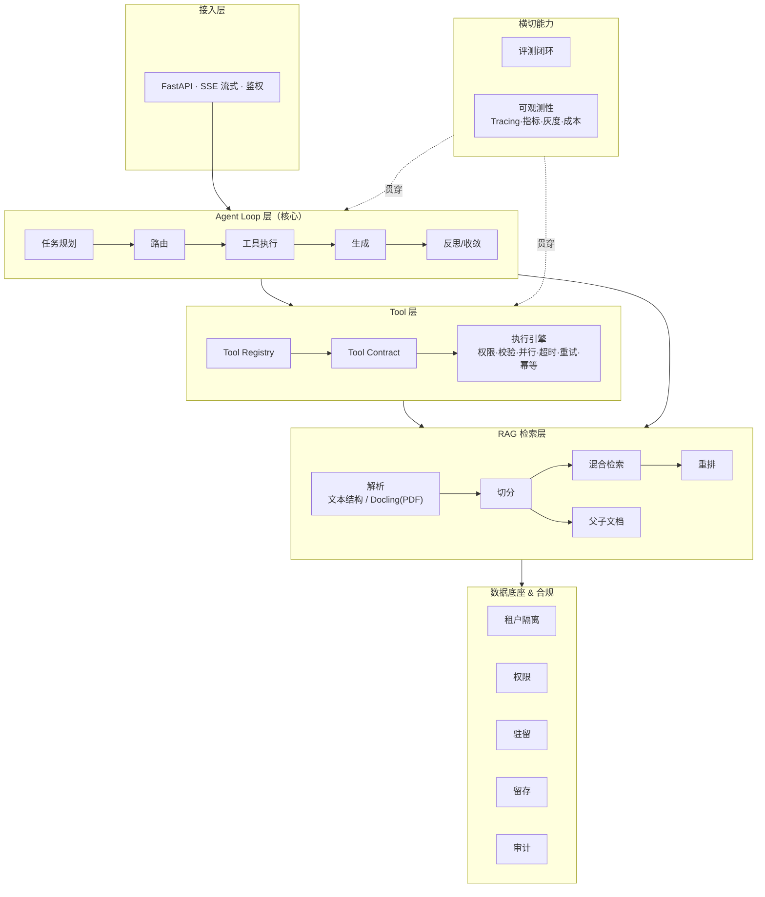
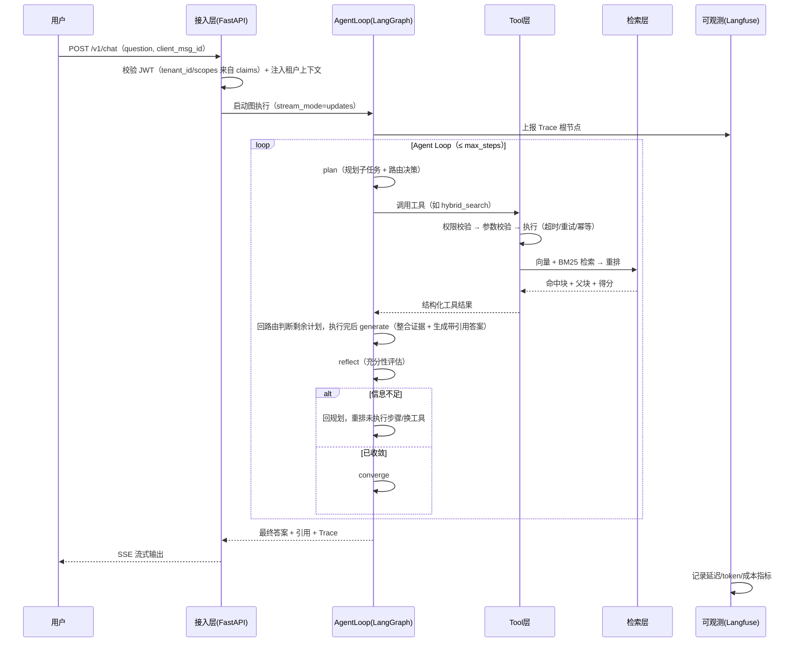

# 02 · 总体架构

## 2.1 六层架构 + 横切能力

### 各层职责

| 层 | 职责 | 关键组件 |
|---|---|---|
| 接入层 | 统一入口、鉴权、SSE 流式、多端适配 | FastAPI、鉴权中间件、会话管理 |
| Agent Loop 层 | 大脑：规划、路由、编排工具、反思、收敛 | LangGraph 图、State、checkpoint |
| Tool 层 | 手脚：注册、契约、执行健壮性 | Registry、Contract、执行引擎、MCP 客户端 |
| RAG 检索层 | 感官：解析、索引、检索、重排 | 结构解析/Docling、切分器、pgvector、tsvector BM25、reranker |
| 数据底座 & 合规 | 地基：隔离、权限、驻留、留存、审计 | 租户上下文、权限过滤器、审计日志 |
| 横切能力 | 质量：评测、Tracing、指标、灰度、成本 | Eval 流水线、Langfuse、发布器 |

**核心设计点**：检索层（L4）不直接接到 Agent Loop 的「必经之路」上，而是以「工具」的身份注册进 Tool 层（L3）。Agent 可以选择不用检索、用一次、或用多次。

## 2.2 技术选型总览

| 模块 | 选型 | 理由 | 备选 |
|---|---|---|---|
| Agent Runtime | **LangGraph** | 原生支持状态机、检查点、恢复、可观测，最贴任职要求 | OpenAI Agents SDK、自研 |
| 语言 | **Python 3.12** | LangGraph 生态最完整；作者正在学 | TypeScript/Go（服务层可选） |
| 服务框架 | **FastAPI** | 异步、SSE 流式友好；作者已有经验 | —— |
| 文档解析 | **轻量文本结构解析 + Docling** | v1 主语料为纯文本条款（kaihe/InsQABench）；Docling 用于补采的真实条款 PDF（布局分析 + 表格结构识别） | Unstructured、PyMuPDF |
| 向量库 | **pgvector** | 复用数据库运维经验、事务一致、免额外服务 | Qdrant、Milvus |
| 关键词检索 | **BM25**（Postgres `tsvector` + jieba 预分词） | 中文召回补全，与向量同库一条 SQL、零额外服务；演进项 ParadeDB pg_search | Elasticsearch（运维重，排除） |
| 重排 | **qwen3.7-text-rerank**（百炼 API） | 与 Embedding/LLM 同供应商、免 GPU 运维、中文效果好；接口抽象可切换 | bge-reranker 本地部署（降级/演进）、Cohere rerank |
| 评测 | **RAGAS + 自研 Judge** | 忠实度/相关性/召回四指标 + 定制评分 | LlamaIndex eval |
| 可观测 | **Langfuse** | 开源，Tracing/指标/成本一体 | LangSmith、自研 OTEL |
| LLM | 可插拔，默认 **qwen3.7-flash（简单）/ qwen3.7-max（复杂）** | 成本低、中文强、原生 function calling，与阶段 0 QA 生成同源 | GPT、Claude；DeepSeek R1 类仅作离线 Judge 候选（需验证 tool-call 支持） |
| Embedding | **qwen3.7-text-embedding**（百炼 API） | 与 LLM/重排同供应商（百炼），中文检索效果好；维度建库时固定（2560/1024/768 等档位），换模型需全量重建索引，v1 定死一个 | bge-m3（开源自建）、text-embedding-v3 |
| 缓存 | Redis | 幂等键、限流、会话 | —— |
| 对象存储 | MinIO / S3 | 原始文档驻留 | 本地磁盘（开发期） |

## 2.3 关键设计决策（ADR 摘要）

### ADR-001：检索工具化，而非流水线化

- **决策**：检索以 Tool 身份进入 Tool Registry，由 Agent 决策调用。
- **理由**：复杂问题需要多轮检索、改写 query、切换关键词，固定流水线无法满足；工具化也天然复用执行引擎的健壮性能力。
- **代价**：增加了延迟与 token 成本，需要渐进式策略与预算控制（见 03）。

### ADR-002：用 LangGraph 而非自研 Runtime

- **决策**：基于 LangGraph 构建，状态管理与检查点交给框架。
- **理由**：自研 Runtime 成本高、易出 bug；LangGraph 的 checkpoint/恢复/可观测是 JD 明确要求的能力，直接用成熟实现并吃透其机制，比「重新发明」更有说服力。
- **代价**：框架学习曲线与版本兼容性（JD 职责边界里「版本兼容」正是要解决的问题）。

### ADR-003：混合检索 + 重排，而非纯向量

- **决策**：向量（语义召回）+ BM25（精确关键词召回）→ 融合 → 重排。
- **理由**：保险条款里大量专有名词/编号（如「等待期」「免赔额」「第 X 条」），纯向量易漏，BM25 补召回，重排提精度。

### ADR-004：父子文档检索

- **决策**：小块做向量索引与召回，命中后返回**父块**（完整段落/小节）喂给 LLM。
- **理由**：避免切分后上下文丢失，兼顾「检索精度」与「生成上下文完整性」。

### ADR-005：评测门禁进 CI

- **决策**：任何影响检索/生成的改动，CI 必须跑离线回归评测 + RAGAS 评分，低于基线即阻断合并。
- **理由**：把「效果不会退化」变成工程约束，而非口头承诺。

### ADR-006：AgentLoop 计划逐步执行，而非每个工具后都生成反思

- **决策**：`tool_node` 执行完回到 `route` 判断剩余计划；`generate`/`reflect` 只在计划执行完（或直接回答）后运行；reflect 增加 `continue_plan`，回环重规划只替换未执行步骤。
- **理由**：避免每个工具后都生成草稿导致 token 成本随步骤数翻倍；消除「剩余计划步骤执行不到、`current_step` 回环清零」的控制流缺陷。
- **代价**：反思粒度变粗，中途工具失败靠失败标记 + 重规划兜底（见 03）。

### ADR-007：评测门禁分层，而非全量进 CI

- **决策**：PR 只跑闭卷集**确定性检索指标全量**（无 LLM）+ 生成评测**分层抽样**（100~200 条，temp=0）；nightly/发布前跑全量；阈值 = 基线 ±2σ（实测 run-to-run 方差）。
- **理由**：~2000 条 QA 全量生成 + LLM Judge 每次 PR 跑不起；LLM 噪声下固定百分比阈值会随机误杀合并。
- **代价**：抽样可能漏掉小样本回归 → 靠 nightly 全量兜底。

### ADR-008：BM25 落在 Postgres 内

- **决策**：写入时 jieba 预分词 → `tsvector`（simple）列 + GIN 索引，与 pgvector 同库。
- **理由**：零额外服务，贴合单机 Docker Compose；向量与关键词一条 SQL 混查。
- **代价**：BM25 分数为近似（`ts_rank`）；需要原生 BM25 分数时演进到 ParadeDB pg_search。

### ADR-009：租户身份来自 JWT，而非请求体

- **决策**：自签 JWT，`tenant_id`/`scopes`/`roles` 作为 claims；请求体不接收 `tenant_id`。
- **理由**：`tenant_id` 由客户端传入等于允许冒充任意租户，租户隔离从入口即失效。
- **代价**：需要 token 签发与校验中间件；OIDC 单点登录留作演进。

## 2.4 端到端请求生命周期

## 2.5 非功能需求（NFR）

延迟按路径分级承诺（寒暄走规则 fast-path 不进 LLM；L0 = 简单事实，L1/L3 = 需理解/计算的复杂问题，难度定义见 06）：

| 类别 | 目标 |
|---|---|
| 延迟（寒暄） | 规则 fast-path 直答，首 token P95 < 1s |
| 延迟（L0 直答路径） | 首 token P95 ≤ 2.5s；总时长 P95 ≤ 8s |
| 延迟（L1/L3 完整 Loop） | 总时长 P95 ≤ 30s；20s 为**熔断线**（触发降级输出），不是承诺值 |
| 可靠性 | Agent 循环必须收敛；工具调用有超时/重试/幂等 |
| 成本 | 单次问答 token 预算上限（**含 reasoning tokens**）；缓存命中可跳过重算 |
| 安全 | 租户身份来自 JWT claims；租户数据隔离；权限过滤；敏感字段脱敏 |
| 合规 | 数据驻留可配置；留存到期自动删除；全程审计 |
| 可观测 | 100% 请求有 Trace；关键指标有仪表盘与告警 |
| 可评测 | PR 分层门禁 + nightly 全量回归（见 06），低于基线 ±2σ 阻断 |
