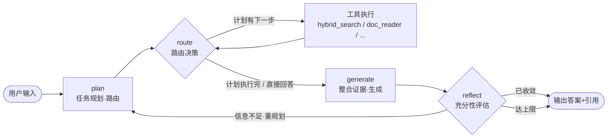

# 03 · AgentLoop 详细设计

> 对应 JD「生产级 AgentLoop：任务规划、状态管理、上下文管理、多轮交互、工具编排、任务收敛」。

## 3.1 设计目标

1. **可规划**：能把复杂问题拆成子任务，决定检索/工具/直接回答的路径。
2. **可反思**：检索结果不充分时能主动补检索、换关键词、换工具。
3. **必收敛**：任何输入都能在有限步内停下来（max_steps + 超时 + 充分性判据）。
4. **可恢复**：任意节点失败或进程重启后，能从检查点续跑。
5. **可观测**：每一步决策、每次工具调用都有 Trace。

## 3.2 状态机总览



> 说明：路由决策可以内聚在 `plan` 节点里，也可以独立成 `route` 节点。文档采用「plan 产出计划、route 按计划逐步调度工具、reflect 决定是否回环」的三段式，职责清晰、便于测试。
>
> **循环粒度**：`tool_node` 执行完**回到 route** 判断剩余计划；`generate`/`reflect` 只在计划执行完（或 route=直接回答）后运行一次——不在每个工具后都生成草稿，避免 token 成本随步骤数翻倍。

## 3.3 State Schema（共享状态定义）

这是整个 AgentLoop 的「血液」，LangGraph 用它在节点间传递、并用它做检查点。

```python
from typing import TypedDict, Annotated, Literal, Any
import operator
from langgraph.graph.message import add_messages
from langchain_core.messages import BaseMessage

class AgentState(TypedDict, total=False):
    # —— 消息与多轮 ——
    messages: Annotated[list[BaseMessage], add_messages]   # 对话历史（增量合并）

    # —— 任务规划 ——
    plan: list[dict]                     # [{"step": 1, "action": "retrieve", "query": "...", "tool": "hybrid_search"}]
    current_step: int                    # 当前执行到第几步；回环重规划时保留，只替换未执行步骤
    route: Literal["retrieve", "answer"]          # 路由决策（plan 产出，route 节点据此调度）

    # —— 检索/工具证据 ——
    evidence: list[dict]                 # 进入生成上下文的证据池 [{tool, result, score, source}]
    tool_results: Annotated[list[dict], operator.add]  # 工具原始返回（append-only，调试/审计）

    # —— 生成与收敛 ——
    draft: str                           # 当前草稿答案
    reflect: dict                        # {"sufficient": bool, "reason": str, "next_action": str}
    final_answer: str                    # 最终答案
    citations: list[dict]                # 引用 [{doc_id, chunk_id, text}]

    # —— 控制与治理 ——
    steps: int                           # 已执行步数（收敛计数）
    max_steps: int                       # 步数上限
    budget: dict                         # {"tokens_used": int, "token_limit": int, "cost": float}
    tenant_id: str                       # 租户上下文（来自 JWT claims，贯穿权限过滤）
```

**关键点**：`messages` 和 `tool_results` 都用**追加型 reducer** 做增量合并——`add_messages` 是为对话消息设计的（按消息 ID 合并），工具结果是普通 dict，用 `operator.add` 即可。每次循环只追加、不重写，天然适合多轮和检查点恢复。中断/恢复直接用 LangGraph 原生 `interrupt()` + `checkpointer`，State 里不需要手工的中断标记。

**三个证据字段的边界**（含关系 `tool_results ⊇ evidence ⊇ citations`）：

| 字段 | 定义 | 用途 |
|---|---|---|
| `tool_results` | 工具的**原始返回**，append-only | 调试、审计、失败归因 |
| `evidence` | 从 tool_results 筛出、**进入生成上下文**的证据（父块文本 + 来源 + 得分） | generate 的输入 |
| `citations` | 答案**实际引用**的 evidence 子集 | 前端溯源、引用评分 |

## 3.4 各节点详细设计

### 3.4.1 plan（任务规划）

- **职责**：把用户问题拆成可执行计划；决定路由；对检索类任务做 query 改写（中文口语 → 检索友好）。
- **输入**：`messages`（历史）、`tenant_id`。
- **输出**：`plan`（子任务列表）、`route`；首次进入时 `current_step=0`，反思回环重规划时**保留 `current_step`、只替换未执行步骤**（已执行的计划与证据不丢）。
- **LLM Prompt 要点**：
  - 「你是保险知识库的检索规划器。判断问题是否需要检索：寒暄/纯常识 → answer；专业条款 → retrieve。」
  - 「需要检索时，输出 query 改写（把『这个保险能不能赔』改写成『理赔范围 条款』）和子任务列表。」
  - 用 **structured output（JSON Schema）** 约束输出，避免解析失败。

```python
class PlanResult(BaseModel):
    route: Literal["retrieve", "answer"]
    plan: list[PlanStep]

class PlanStep(BaseModel):
    step: int
    action: Literal["retrieve", "tool"]
    tool: str                      # 工具名
    query: str                     # 已改写的检索 query
    rationale: str                 # 为什么这样做
```

### 3.4.2 route（路由调度）

- **职责**：根据 `plan[current_step]` 决定下一步——调用哪个工具、还是进入生成；`tool_node` 执行完后回到本节点，判断计划是否还有剩余步骤。
- **逻辑**：纯确定性逻辑（无 LLM），保证可测试、可预测。
- **规则**：
  - `route == "answer"` → 进入 `generate`；
  - 计划未执行完 → 取 `plan[current_step].tool` 进入 `tool_node`；
  - 计划已执行完 → 进入 `generate`。

### 3.4.3 tool_node（工具执行）

- **职责**：把 `plan[current_step]` 转成一次工具调用，交给 Tool 层执行（见 04），结果写入 `tool_results` 与 `evidence`。
- **并行调用**：同一步若有多个独立工具调用，Tool 层并行执行、结果合并。
- **失败处理**：工具抛异常 → 记录到 `evidence`（标记 failed），由 `reflect` 决定是否换工具/换关键词，而非直接中断。

### 3.4.4 generate（生成）

- **职责**：基于 `evidence` 整合证据，生成**带引用**的答案草稿。
- **输入**：`evidence`（含父块文本 + 来源）、`messages`。
- **输出**：`draft`、`citations`。
- **Prompt 要点**：
  - 「只依据提供的资料回答，资料不足时明确说『资料不足』，禁止编造。」
  - 「每个结论后标注引用编号 [1][2]。」
- **引用格式**：`citations` 用 `{doc_id, chunk_id, text, score}` 结构化返回，前端可点击溯源。

### 3.4.5 reflect（反思与收敛）

- **职责**：评估草稿是否充分，决定「输出 / 继续执行计划 / 回环重规划 / 达上限强制输出」。
- **充分性判据**（LLM 打分 + 硬规则）：
  - 硬规则（确定性）：`steps >= max_steps` → 强制收敛；`budget.tokens_used >= token_limit` → 强制收敛；证据为空且已尝试 ≥ 2 次 → 输出「资料不足」。
  - LLM 判据：证据是否覆盖问题所有子任务、草稿是否自洽、是否有幻觉风险。

```python
class ReflectResult(BaseModel):
    sufficient: bool
    reason: str
    next_action: Literal["converge", "continue_plan", "retrieve_more", "rewrite_query", "switch_tool"]
    next_query: str | None
```

> `continue_plan`：计划还有剩余步骤时直接回 route 继续执行（不过 LLM 重规划）；`retrieve_more` / `rewrite_query` / `switch_tool` 回 plan **只重排未执行步骤**。

### 3.4.6 converge（收敛输出）

- **职责**：确定 `final_answer`，组装引用，结束循环，上报完整 Trace。

## 3.5 收敛策略（三重保险）

| 保险 | 机制 | 默认值 |
|---|---|---|
| 步数上限 | `steps >= max_steps` 强制收敛 | 6 |
| 超时 | 整个图执行 wall-clock 超时 | 20s |
| 成本预算 | token 预算耗尽即收敛 | 8000 token |

**渐进式检索策略**（权衡延迟/成本/效果的核心）：
1. 第一轮：plan 产出完整计划（可含多个检索步骤）→ route 逐步执行 → 生成 → 反思；
2. 若不足：回环 plan 重规划（改写 query / 换工具 / 补检索，**只替换未执行步骤**）→ 第二轮；
3. 若仍不足且未超预算：第三轮（最多）→ 无论如何收敛，输出「已尽力 + 资料不足提示」。

> 效果 > 延迟的深层问题通常不值得无限循环，3 次检索 + 硬上限是「确定性交付」的务实选择。

## 3.6 上下文管理与多轮对话

| 手段 | 用途 | 触发条件 |
|---|---|---|
| 滑动窗口 | 只保留最近 N 轮消息 | 始终 |
| 摘要压缩 | 长对话压缩历史为摘要 | 历史 token 超过阈值（如 3000） |
| 证据链保留 | 摘要时**保留引用与结论**，不丢关键证据 | 压缩时 |
| 会话记忆 | 跨轮记住用户身份/偏好/已确认事实 | 明确出现 |

**上下文压缩 vs 信息丢失**的平衡：摘要只压缩「对话过程」，**不压缩「已检索到的证据与结论」**——忠实度优先，宁可上下文长一点，也不丢溯源依据。

## 3.7 错误处理与恢复

- **节点级重试**：LLM 调用失败/超时 → 指数退避重试（最多 3 次）。
- **检查点恢复**：LangGraph 的 `checkpointer` 持久化 State，进程崩溃后从最后一个成功节点续跑（`interrupt()` / resume 由框架原生支持，人工或自动触发）。
- **优雅降级**：检索层故障 → 输出「服务暂不可用」并降级为「直接回答 + 明确提示」，不编造。

## 3.8 代码骨架

```python
from langgraph.graph import StateGraph, START, END
from langgraph.checkpoint.memory import MemorySaver

def build_graph(llm, tools, retriever):
    g = StateGraph(AgentState)

    g.add_node("plan", make_plan(llm))
    g.add_node("route", route)
    g.add_node("tool_node", ToolNode(tools))       # 复用 04 的执行引擎
    g.add_node("generate", generate(llm))
    g.add_node("reflect", reflect(llm))
    g.add_node("converge", converge)

    g.add_edge(START, "plan")
    g.add_edge("plan", "route")
    g.add_conditional_edges("route", route_fn, {
        "retrieve": "tool_node", "answer": "generate",
    })
    g.add_edge("tool_node", "route")   # 执行完回路由，判断剩余计划
    g.add_conditional_edges("reflect", reflect_fn, {
        "converge": "converge",
        "continue_plan": "route",     # 计划还有剩余步骤，直接继续
        "retrieve_more": "plan",      # 回环重规划（只替换未执行步骤）
        "rewrite_query": "plan",
        "switch_tool": "plan",
    })
    g.add_edge("generate", "reflect")
    g.add_edge("converge", END)

    return g.compile(checkpointer=MemorySaver())  # 生产换 PostgresSaver
```

> 生产环境将 `MemorySaver` 换成 `PostgresSaver`，检查点落库，实现真正的跨进程恢复与多副本部署。
