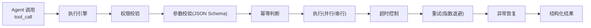

# 04 · Tool 层设计

> 对应 JD「接入和演进 Tool Registry、Tool Contract、Function Calling 或 MCP，处理工具权限、参数校验、并行调用、超时、重试、幂等和异常恢复」。

## 4.1 设计目标

把「工具」抽象为三件套，让健壮性能力成为**可复用中间件**，而非散落在每个工具实现里：

1. **Tool Registry**：工具的统一注册与发现。
2. **Tool Contract**：用 JSON Schema 声明输入/输出，驱动校验与 LLM Function Calling。
3. **执行引擎（Executor）**：权限 → 校验 → 并行 → 超时 → 重试 → 幂等 → 异常恢复的统一执行管道。



## 4.2 Tool Contract（JSON Schema）

每个工具一份契约，同时服务三个目的：**LLM Function Calling 的 schema**、**参数校验**、**文档即代码**。

```python
from pydantic import BaseModel, Field

class VectorSearchInput(BaseModel):
    """向量检索工具输入契约"""
    query: str = Field(description="检索查询，应为检索友好的改写后 query")
    top_k: int = Field(default=5, ge=1, le=20, description="返回结果数量")
    filters: dict | None = Field(default=None, description="元数据过滤，如 {product: '重疾险'}")
    use_rerank: bool = Field(default=True)

class ToolContract(BaseModel):
    name: str
    description: str
    input_schema: dict          # VectorSearchInput.model_json_schema()
    output_schema: dict
    timeout_ms: int = 5000
    max_retries: int = 2
    idempotent: bool = True     # 是否幂等
    parallel_safe: bool = True  # 是否可并行
    required_scopes: list[str]  # 权限域（scope），如 ["retrieval:read"]；与文档密级 visibility（07）区分
```

- `output_schema` 在 v1 的用途是**文档 + structured output 约束**（生成侧 JSON Schema），不做工具返回值的强校验；强校验作为演进项。

契约同时会转换为 LLM 可用的 tools 定义：

```python
{
  "type": "function",
  "function": {
    "name": "hybrid_search",
    "description": "在保险知识库中做混合检索（向量+关键词+重排）",
    "parameters": VectorSearchInput.model_json_schema()
  }
}
```

## 4.3 执行引擎（健壮性中间件）

### 4.3.1 权限校验（Permission）

- 每个工具声明 `required_scopes`（**权限域**）；执行前校验 JWT claims 中的租户 scope 是否具备。
- 检索类工具额外注入**租户过滤器与密级（visibility）过滤**，从源头保证数据隔离（见 07）。

### 4.3.2 参数校验（Validation）

- 用 `input_schema` 做 Pydantic 校验，非法参数**在进入工具前**被拦截，返回结构化错误（而非让工具崩溃）。

### 4.3.3 并行调用（Parallel）

- 同一计划步骤里的多个独立工具，用 `asyncio.gather` 并行执行。
- `parallel_safe=False` 的工具（如写操作）串行执行，避免竞态。

### 4.3.4 超时（Timeout）

- 每个工具独立 `timeout_ms`，用 `asyncio.wait_for` 控制。
- 超时不杀进程，返回 `ToolTimeoutError`，交给上层（reflect）决定重试或降级。

### 4.3.5 重试（Retry）

- 仅对**可重试错误**（网络抖动、超时、5xx）做指数退避重试。
- 不可重试错误（参数非法、权限拒绝、4xx）直接失败，不浪费重试。

```python
def is_retryable(exc: Exception) -> bool:
    return isinstance(exc, (ToolTimeoutError, NetworkError, ServiceUnavailableError))
    # 参数非法、权限拒绝、资源不存在 → False
```

### 4.3.6 幂等（Idempotency）

- 写类工具（如「记录用户确认」）接受 `idempotency_key`，Redis 记录执行状态，重复请求返回首次结果，避免重试/重放造成副作用。
- **非幂等工具不参与重试**：超时后副作用状态未知（可能已写入），只能查询确认，不能盲目重发。
- 读类工具天然幂等，`idempotent=True` 仅作标注。

### 4.3.7 异常恢复（Recovery）

- 工具异常统一包装为 `ToolExecutionError`，携带 `tool_name`、`retried`、`duration`、`trace_id`。
- 执行引擎不吞异常，而是把失败结果写入 `evidence`（failed 标记），让 `reflect` 决策（换工具/换关键词/降级）。

## 4.4 MCP 接入

- 实现一个 **MCP Client**，把外部 MCP Server 提供的工具**动态注册**进 Tool Registry，与内置工具统一调度。
- 契约从 MCP 的 `tools/list` 与 JSON Schema 自动生成，无需手工维护。

```python
# 概念示意
from mcp import ClientSession

async def register_mcp_tools(registry: ToolRegistry, session: ClientSession):
    for tool in await session.list_tools():
        registry.register(
            name=f"mcp.{tool.name}",
            contract=ToolContract(
                name=tool.name,
                description=tool.description,
                input_schema=tool.inputSchema,
                output_schema={},
            ),
            handler=MCPServerTool(session, tool.name),
        )
```

> 这直接命中 JD 里「MCP」关键词，也体现「Tool Registry 可演进」的设计原则。

## 4.5 内置工具清单（首个场景）

| 工具 | 类型 | 说明 | LLM 可见 | 幂等 | 并行安全 |
|---|---|---|---|---|---|
| `hybrid_search` | 检索 | 向量 + BM25 融合 + 重排（主力检索工具，见 05） | ✅ | ✅ | ✅ |
| `doc_reader` | 读取 | 按 doc_id/chunk_id 精读父块 | ✅ | ✅ | ✅ |
| `sql_query` | 数据 | 查询结构化保单数据（只读） | 按场景 | ✅ | ✅ |
| `calculator` | 工具 | 保费/等待期计算 | 按场景 | ✅ | ✅ |
| `record_confirmation` | 写 | 记录用户对条款的确认 | 按场景 | ❌ | ❌ |
| `vector_search` / `bm25_search` | 检索 | hybrid 的内部路径，不单独暴露给 LLM | ❌（内部） | ✅ | ✅ |
| `web_search` | 检索 | **v1 移除**：与数据不出域（07）矛盾；如开通需租户显式授权 + region 策略，留作演进 | —— | —— | —— |

> **工具面收敛**：LLM 只见 `hybrid_search` + `doc_reader`（sql_query / calculator / record_confirmation 按场景加入）。三个检索工具全部暴露会让规划器在选择间抖动、产生重复检索；vector/bm25 作为 hybrid 的内部路径，仅当 reflect 判定关键词召回不足时按需升级暴露。

## 4.6 Tool Registry 代码骨架

```python
class ToolRegistry:
    def __init__(self):
        self._tools: dict[str, RegisteredTool] = {}

    def register(self, name, contract, handler): ...
    def get(self, name) -> RegisteredTool: ...
    def get_llm_schemas(self, scopes: list[str]) -> list[dict]:
        """按租户权限返回可用的 Function Calling schema"""
        return [t.contract.to_llm() for t in self._tools.values()
                if set(t.contract.required_scopes) <= set(scopes)]

    async def execute(self, call: ToolCall, ctx: ExecContext) -> ToolResult:
        tool = self.get(call.name)
        await self._guard.check_permission(tool, ctx)      # 权限
        args = self._guard.validate(tool, call.arguments)  # 校验
        return await self._executor.run(tool, args, ctx)   # 并行/超时/重试/幂等
```

> 设计要点：`get_llm_schemas(scopes)` 让**模型只能看到它有权调用的工具**，从源头实现「工具权限」的收敛。
