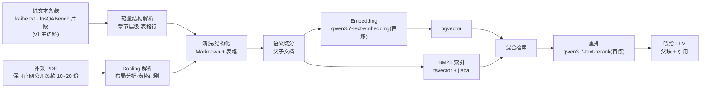
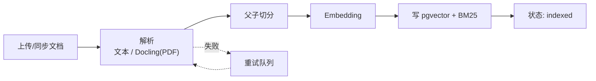

# 05 · RAG 数据管道设计

> 对应 JD 加分项「RAG、向量检索」，并落地文档解析、父子文档检索、混合检索、重排。

## 5.1 管道总览



## 5.2 文档解析（轻量解析 + Docling）

- **v1 主语料是纯文本**（kaihe 完整条款 txt、InsQABench 证据片段，见 `data/README.md`），解析层用**轻量结构解析**：按「1 / 1.1 / 2.3.1」数字编号识别章节层级、按行识别表格，输出带结构元数据的 Markdown。
- **Docling 用于补采的真实 PDF**：从保司官网公开渠道采 10~20 份条款 PDF（清单见 `data/contract_fetch_list.csv`），专供「PDF → 布局分析 → 表格结构识别」链路的演示与表格召回抽查；主评测语料仍为纯文本。
- 两条路径输出统一为 **Markdown 中间格式**，带结构元数据（标题层级、表格、页码、区块类型）。

```python
# PDF 路径（补采语料）示意
from docling.document_converter import DocumentConverter

converter = DocumentConverter()
result = converter.convert("保单条款.pdf")
markdown = result.document.export_to_markdown()   # 结构化 Markdown
tables   = result.document.tables                  # 结构化表格对象
```

- **为什么要补 PDF + Docling**：保险条款有大量表格（保障责任表、费率表、等待期表），普通文本抽取会破坏结构，Docling 的表格识别能保留「行-列-单元格」语义，检索时可按表格单元格命中。

## 5.3 切分策略（父子文档）

- **子块（child chunk）**：小而精确，用于**向量索引与召回**。按语义边界（标题/段落/表格行）切分，约 300~500 token，重叠 10%。
- **父块（parent chunk）**：完整上下文，用于**喂给 LLM**。通常是一个完整小节、一张完整表格、或一个条款段落。
- **映射关系**：**父块独立成行存储**，子块通过 `parent_id` 关联；检索命中子块后按 `parent_id` 取父块文本。不在子块行冗余存父块全文，避免存储翻倍与更新不一致。

```python
class Chunk(BaseModel):
    chunk_id: str
    chunk_type: Literal["parent", "child"]
    parent_id: str | None     # 父块 ID；父块自身该字段为空
    text: str                 # 本块文本（父块=完整上下文；子块=用于向量化）
    metadata: dict            # {doc_id, title, section, page}
```

**父子文档为什么重要**：如果直接用小块喂 LLM，会因切分丢失上下文（一个条款的「除外责任」被切到前一块、正文在另一块）；用父块则保证答案有完整依据。这正是作者正在研究的「parent document retrieval」。

## 5.4 混合检索（Hybrid Retrieval）

- **向量检索**：语义召回，处理「理赔范围有哪些」这类自然语言。
- **BM25 关键词检索**：精确召回，处理「等待期 90 天」「免赔额 1 万」这类专有名词/编号。
- **融合**：RRF（Reciprocal Rank Fusion）融合两路结果，无需调权重、鲁棒。

```python
def rrf(results_a, results_b, k=60):
    scores = {}
    for rank, item in enumerate(results_a):
        scores[item.id] = scores.get(item.id, 0) + 1.0 / (k + rank + 1)
    for rank, item in enumerate(results_b):
        scores[item.id] = scores.get(item.id, 0) + 1.0 / (k + rank + 1)
    return sorted(scores.items(), key=lambda x: -x[1])
```

- 中文 BM25 需 **jieba 分词** + 自定义词典（保险术语：「免赔额」「等待期」「重疾」「轻症」）。
- **落地载体（ADR-008）**：Postgres 内做——写入时 jieba 预分词，分词结果以空格拼接经 `to_tsvector('simple', ...)` 存入 `tsvector` 列 + GIN 索引；与 pgvector 同库，混合检索一条 SQL、零额外服务。需要原生 BM25 分数时演进到 ParadeDB pg_search；不引入 Elasticsearch（运维重）。

## 5.5 重排（Rerank）

- 混合检索返回 top-50 候选，用百炼 **qwen3.7-text-rerank** 做精排，取 top-5。
- 重排模型做的是「query 与 doc 的深度语义相关性」，弥补向量检索「有召回但排序不准」的问题。
- **Serving**：纯 API 调用（百炼），无自建 reranker 服务；接口抽象保留，开源本地部署（如 bge-reranker，GPU/ONNX）作为降级与演进项。

```python
# 百炼 DashScope 调用示意
resp = rerank_client.rerank(
    model="qwen3.7-text-rerank",
    query=query,
    documents=[doc.text for doc in candidates],
    top_n=5,
)
```

## 5.6 向量库选型与索引

| 选型 | pgvector | 理由 |
|---|---|---|
| 存储 | PostgreSQL + pgvector 扩展 | 复用 DB 运维经验；向量与元数据同库，过滤与向量检索一条 SQL |
| 索引 | HNSW | 高召回 + 低延迟 |
| 租户隔离 | 每个 chunk 带 `tenant_id`，查询加 `WHERE tenant_id = ?` | 与 07 数据底座统一 |

```sql
-- 概念示意
CREATE INDEX ON chunks USING hnsw (embedding vector_cosine_ops)
  WHERE tenant_id IS NOT NULL;

SELECT c.chunk_id, p.text AS parent_text
FROM chunks c
JOIN chunks p ON p.chunk_id = c.parent_id      -- 父块独立成行
WHERE c.tenant_id = $1
ORDER BY c.embedding <=> $2::vector
LIMIT 50;
```

- **过滤条件与 HNSW 的召回退化**：pgvector 的索引扫描发生在过滤之前，`WHERE tenant_id = ...` 可能导致实际返回不足 top_k。对策：pgvector ≥ 0.8 开启迭代扫描（`hnsw.iterative_scan`）并调高 `hnsw.ef_search`，或一次取超采样候选再过滤；单租户数据量极大时演进为按租户分区。
- **维度与换模**：embedding 列维度在**建库时固定**（qwen3.7-text-embedding 支持 2560/1024/768 等档位，以百炼文档为准），更换 embedding 模型或维度 = 全量重建索引，故 embedding 模型版本与文档版本一起纳入缓存键（见 06.9）。

## 5.7 离线索引流水线

- 与在线服务解耦的**异步任务**（Celery / RQ / FastAPI BackgroundTask）。
- 流程：监听新文档 → 解析（文本轻量解析 / Docling-PDF）→ 切分 → 生成父子块 → embedding → 写 pgvector + BM25（tsvector）索引 → 更新文档状态 → 上报指标。
- **幂等**：以 `doc_id + version` 为键（`DOCUMENT` 表含 `version` 列，见 07.7），重复触发不重复入库。
- **失败恢复**：每个文档一条任务记录，失败可重放。



## 5.8 检索质量的关键取舍

| 问题 | 手段 |
|---|---|
| 召回不足（漏） | BM25 补精确召回 + query 改写（Agent 里做） |
| 排序不准（乱） | reranker 精排 |
| 上下文丢失（断） | 父子文档 |
| 表格理解差（碎） | Docling 表格结构识别 |
| 中文分词差 | jieba + 保险术语自定义词典 |
