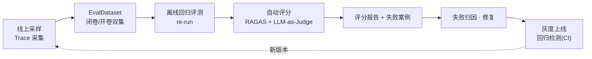

# 06 · 评测闭环与生产质量

> 对应 JD「建立 Agent 效果评测闭环」与「建设生产质量能力」。

## 6.1 评测闭环总览



核心思想：**改一行代码，都能看到分数涨跌**——把「效果不会退化」变成 CI 里的硬门禁，而非口头承诺。

## 6.2 EvalDataset（评测数据集）

- 三层结构：**Golden Set**（标准答案）+ **Sampled Set**（线上真实 query 采样）+ **Adversarial Set**（对抗/边界用例）。
- **与实际数据的映射**（阶段 0 已完成，来源与限制详见 `data/README.md`）：

| 评测集 | 数据 | 评测目标 |
|---|---|---|
| 闭卷集（检索） | kaihe 完整条款 102 份 + 生成 QA 985 条 + L4 拒答题 51 条 | **检索召回**（不给证据片段，真检索） |
| 开卷集（生成） | InsQABench 1060 条（自带证据片段） | **生成质量 + 引用忠实度** |
| Adversarial | L4 拒答题 51 条；L2 多跳待补、难度标签待复核 | 拒答边界 / 幻觉 |

```json
{
  "id": "eval-0001",
  "question": "这款重疾险的等待期是多少天？",
  "gold_answer": "等待期为 90 天，自合同生效日起算。",
  "source_docs": ["doc_rzx_2024.pdf"],
  "ground_truth_chunks": ["chunk-xxx"],
  "type": "factual",
  "tags": ["等待期", "重疾险"],
  "difficulty": "easy"
}
```

## 6.3 离线回归评测（re-run）

- **re-run（本项目采用）**：同一评测 query 在新版代码/配置上**重新执行**，对比新旧版本在「检索命中、工具选择、最终答案、延迟、成本」上的差异。LLM 是被测变量，必须真跑才能测出 prompt/模型变更的效果；评测统一 temp=0 + 固定检索参数，压低 run-to-run 方差（阈值口径见 6.6）。
- **真回放（record & replay，v1 不做）**：录制 LLM/工具响应后原样重放，只能验证**编排代码**的行为一致性，测不出 LLM 侧变化。Trace 落库（query + 各节点决策 + 工具调用 + 中间结果）的定位是**调试与线上采样数据源**，不做回放源。
- 关键价值：不依赖真实用户就能做**效果回归**。

```python
# 概念：重新执行一个评测 query，产出可对比的执行轨迹
async def rerun(request: ReplayRequest) -> ReplayTrace:
    trace = await agent.run(request.question, tenant_id=request.tenant_id)
    return ReplayTrace(
        question=request.question,
        steps=trace.steps,          # 每步：节点名、决策、工具、耗时、token
        final_answer=trace.final_answer,
        latency_ms=trace.latency_ms,
        cost=trace.cost,
    )
```

## 6.4 自动评分（RAGAS + LLM-as-Judge）

### RAGAS 四指标

| 指标 | 含义 | 回答的问题 |
|---|---|---|
| Faithfulness（忠实度） | 答案是否**只基于**检索到的证据 | 有没有幻觉 |
| Answer Relevancy（答案相关性） | 答案是否切题 | 有没有跑题 |
| Context Precision（上下文精度） | 检索结果里相关块占比 | 召回精不精 |
| Context Recall（上下文召回） | 证据里是否包含标准答案所需信息 | 召回全不全 |

### LLM-as-Judge（自研评分）

- 对 RAGAS 覆盖不到的业务维度打分：**条款引用准确性**、**免责声明是否合规**、**回答格式是否规范**。
- 用结构化输出（JSON Schema）约束 Judge，输出 `{score, reason}`，可追溯。

```python
class JudgeResult(BaseModel):
    score: float = Field(ge=0, le=1)
    reason: str
    passed: bool
```

### 评分流水线

```python
from ragas import evaluate
from ragas.metrics import faithfulness, answer_relevancy, context_precision, context_recall

scores = evaluate(dataset, metrics=[
    faithfulness, answer_relevancy, context_precision, context_recall,
])
# 叠加自研 Judge，产出一份带失败原因的报告
report = build_report(scores, judge_results)
```

## 6.5 失败归因（四象限）

把失败案例按「问题出在哪一层」归类，直接对应 JD 的「定位模型、Prompt、工具或数据导致的效果问题」：

| 象限 | 症状 | 定位方向 | 修复手段 |
|---|---|---|---|
| 数据/索引 | 该召回的内容没进索引 | 文档解析/切分/索引问题 | 改进 Docling 解析、切分、词典 |
| 检索 | 进了索引但没召回/排序靠后 | 检索/重排问题 | 调 RRF、换 embedding/reranker |
| Agent | 召回了但没用好、多轮混乱 | 规划/反思问题 | 改 plan/reflect Prompt、收敛策略 |
| 生成 | 证据对但答案错/幻觉 | 生成/引用问题 | 强化引用约束、防幻觉 Prompt |

> 这四象限是面试时最能体现「效果优化方法论」的抓手。

## 6.6 回归检测（分层 CI 门禁，ADR-007）

| 层级 | 触发 | 内容 | 阈值 |
|---|---|---|---|
| PR 门禁 | 每次 PR | 闭卷集**确定性检索指标全量**（Recall@k、引用命中率，无 LLM，快且稳）+ 生成评测**分层抽样 100~200 条**（按难度×险种，temp=0） | 低于基线 2σ 阻断 |
| Nightly / 发布前 | 定时 / 发布 | 全量（闭卷 985 + 开卷 1060 + L4 拒答） | 同上；延迟/成本超预算 → 告警 |

- **阈值口径**：先在基线版本连跑 3 次测出各指标的 run-to-run 方差，阈值 = 基线 ±2σ。不用拍脑袋的固定百分比——LLM Judge 存在噪声，固定阈值（如「降 5% 阻断」）会随机误杀合并。
- 失败案例新增 → 进入归因队列（6.5）。

```yaml
# CI 概念示意（GitHub Actions）
jobs:
  eval:
    steps:
      - run: python -m eval.retrieval_gate --dataset kaihe_closed --baseline baseline.json
        # 确定性检索指标全量，秒级~分钟级
      - run: python -m eval.gate --report report.json --baseline baseline.json --sigma 2
        # 生成评测抽样，低于基线 2σ → 非零退出码 → 阻断
```

## 6.7 可观测性（Tracing / 日志 / 指标）

| 能力 | 工具 | 内容 |
|---|---|---|
| Tracing | Langfuse | 每次 Agent 循环：节点、决策、工具调用、token、耗时 |
| 指标 | Prometheus + Grafana | 延迟 P50/P95、token 消耗、检索命中率、评测分数趋势 |
| 日志 | 结构化 JSON | 带 `trace_id`、`tenant_id`、`session_id`，可关联 |
| 告警 | Alertmanager | 延迟/错误率/成本超阈值 |

- **关键原则**：`trace_id` 贯穿「接入层 → AgentLoop → Tool → 检索」全链路，任何一次失败都能回溯到具体节点与工具。

## 6.8 版本管理 / 灰度发布 / 回滚

| 能力 | 机制 |
|---|---|
| 版本管理 | Prompt、Agent 图、模型、检索参数都有版本号，作为配置管理 |
| 灰度发布 | 按租户/流量比例路由到新版本（canary 5% → 30% → 100%） |
| 回滚 | 版本一键回退；评测分数与线上指标是回滚的判据 |
| 成本监控 | 每次请求结算 token 与金额，按租户/场景聚合，超预算告警 |

## 6.9 成本控制

- **token 预算**：单请求 `token_limit`（**含 reasoning tokens**），Agent 循环内累计、超限强制收敛。
- **缓存**：缓存键 = query + 文档版本 + prompt 版本 + 模型 + 检索参数——任何影响输出的因子变化都不得命中旧缓存，跳过 embedding 与生成。
- **模型分级**：简单问题用小模型（qwen3.7-flash），复杂问题才上大模型（qwen3.7-max）。
- **重排降本**：先向量粗召回 top-50，再重排精排，避免全量精排。
