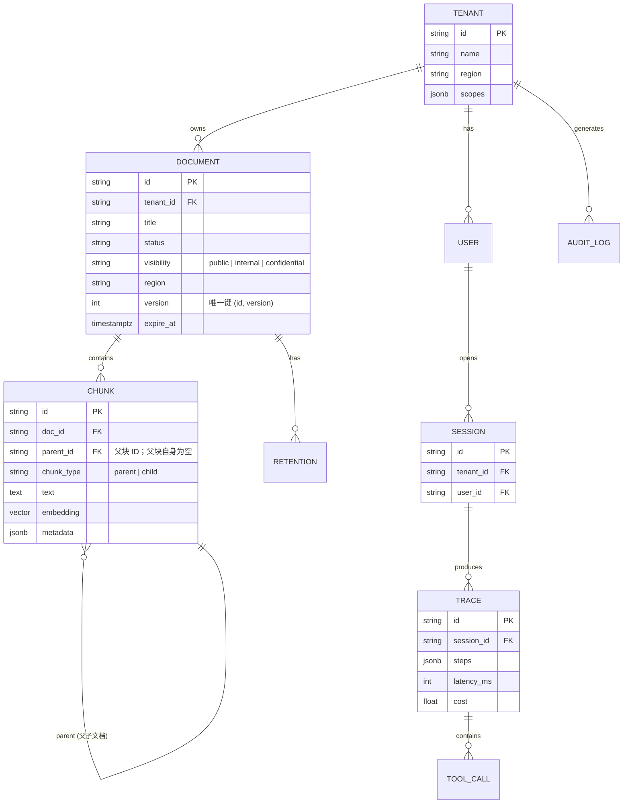

# 07 · 数据底座、合规与数据模型

> 对应 JD「数据获取与存储底座、权限、区域路由、留存删除和审计机制」及加分项「数据权限、租户隔离、数据驻留、留存删除」。

## 7.1 合规能力总览

| 能力 | 机制 | 落地位置 |
|---|---|---|
| 租户隔离 | 全表带 `tenant_id`，查询强制注入过滤 | 数据层 + 检索层 |
| 数据权限 | 租户内按权限域（`scope`）授权 + 文档密级（`visibility`）过滤 | Tool 层 + 数据层 |
| 区域路由 | 按 `region` 将数据写入指定地域存储 | 数据底座 |
| 留存删除 | 文档带 `expire_at`，到期自动删除 + 向量同步删除 | 后台任务 |
| 审计 | 关键操作（读/写/删除/导出）全量审计日志 | 审计表 + 日志 |

## 7.2 租户隔离（多租户）

- **策略**：共享表 + `tenant_id` 行级隔离（业务规模下最简单可靠，符合首个场景定位）。
- **强制手段**：数据访问层（DAO）统一注入 `WHERE tenant_id = ?`，不允许绕过；检索查询同样强制 `tenant_id` 过滤，从 SQL 层面杜绝越权。

```sql
-- 所有业务查询都带租户条件
SELECT c.text FROM chunks c
WHERE c.tenant_id = :tenant_id AND c.doc_id = :doc_id;
```

- **演进**：单租户数据量极大时，可升级为 `schema-per-tenant` 或 `database-per-tenant`，接口不变。

## 7.3 数据权限（权限域 + 密级）

- 术语约定：**`scope` 专指工具权限域**（见 04，如 `retrieval:read`）；**`visibility` 指文档密级**（`public` / `internal` / `confidential`），两者不混用。
- 每个文档标注 `visibility`，租户内角色可访问的密级不同。
- 检索时权限过滤器与向量查询合并：

```python
filters = {"tenant_id": ctx.tenant_id, "visibility": {"$in": ctx.allowed_visibilities}}
```

- 与 04 的 `required_scopes` 呼应：**模型只能看到它有权调的工具（权限域），工具只能查它该看的密级（visibility）**，形成双层收敛。

## 7.4 区域路由与数据驻留（Data Residency）

- 文档带 `region` 元数据（如 `cn` / `sg` / `eu`），写入时路由到对应地域的对象存储与向量库分片。
- 检索时按请求来源 region 路由到对应分片，保证「数据不出域」。
- 首个场景默认单 region（`cn`），架构上预留 `region` 字段与分片键。

## 7.5 留存删除（Retention）

- 每个文档有 `retention_policy`（如「合同到期后保留 30 天」），换算成 `expire_at`。
- 后台任务每日扫描 `expire_at <= now()` 的文档：
  1. 标记 `status = expired`；
  2. 删除向量与 BM25 索引；
  3. 删除对象存储原始文件；
  4. 写一条审计日志。
- **删除是软删 → 物理删两阶段**，可审计、可追溯。

## 7.6 审计（Audit）

- 记录 `who`（租户/用户/Agent）、`what`（读/写/删除/导出）、`when`、`where`（region）、`result`。
- 审计日志独立存储、只追加；**不可篡改的落地口径**：hash chain——每行含 `prev_hash`，`hash = H(prev_hash || 本行内容)`，后台任务周期校验链完整性，篡改任意历史行都会断链可检。

```sql
CREATE TABLE audit_log (
    id BIGSERIAL PRIMARY KEY,
    tenant_id TEXT NOT NULL,
    actor TEXT NOT NULL,
    action TEXT NOT NULL,           -- read / write / delete / export
    resource TEXT NOT NULL,          -- doc_id / chunk_id
    region TEXT,
    result TEXT,
    trace_id TEXT,
    prev_hash TEXT,                  -- 前一条哈希（hash chain 防篡改）
    hash TEXT NOT NULL,              -- H(prev_hash || 本行内容)
    created_at TIMESTAMPTZ DEFAULT now()
);
```

## 7.7 核心数据模型（ER 图）



### 关键表说明

| 表 | 说明 |
|---|---|
| `tenant` | 租户，含 region 与权限域 scope |
| `document` | 文档，含 visibility（密级）、region、expire_at、version（索引幂等键，见 05.7） |
| `chunk` | 父子块：**父块独立成行**，子块 `parent_id` 关联；含 embedding（向量） |
| `session` / `trace` | 会话与 Trace（可观测 + 线上采样的数据源） |
| `audit_log` | 审计（只追加 + hash chain） |

> 设计意图：把**合规三要素（visibility/region/expire_at）内嵌到 document 表**，让权限、驻留、留存成为数据模型的一等公民，而非事后补丁。
