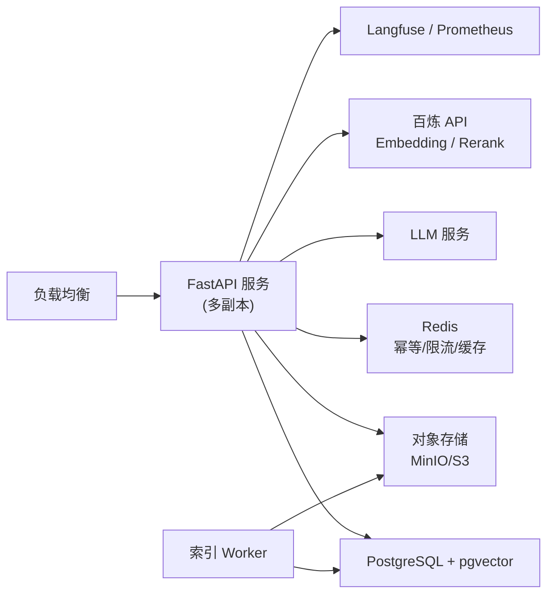

# 08 · API 接口与代码目录结构

> 对应 JD「设计清晰、可靠、可演进的服务接口」。

## 8.1 接口总览

| 方法 | 路径 | 说明 |
|---|---|---|
| POST | `/v1/chat` | 创建会话消息，SSE 流式返回 |
| GET | `/v1/sessions/{id}` | 查询会话历史 |
| DELETE | `/v1/sessions/{id}` | 删除会话（触发留存） |
| POST | `/v1/documents` | 上传文档，触发索引 |
| GET | `/v1/documents/{id}/status` | 查询索引状态 |
| DELETE | `/v1/documents/{id}` | 删除文档（软删 → 物理删） |
| POST | `/v1/eval/replay` | 触发离线评测（内部/管理端） |
| GET | `/v1/health` | 健康检查 |

## 8.2 核心接口：对话（SSE 流式）

```http
POST /v1/chat
Authorization: Bearer <JWT>      # claims: tenant_id / scopes / roles
Content-Type: application/json

{
  "session_id": "sess-001",       // 可选，缺省新建会话
  "client_msg_id": "cm-0001",     // 客户端生成的消息 ID，幂等键的一部分
  "question": "这款重疾险等待期多久？"
}
```

SSE 事件流（`text/event-stream`）：

```
event: plan
data: {"trace_id":"trace-001","route":"retrieve","plan":[{"step":1,"action":"retrieve","query":"重疾险 等待期"}]}

event: tool_call
data: {"trace_id":"trace-001","tool":"hybrid_search","status":"running"}

event: evidence
data: {"trace_id":"trace-001","sources":[{"doc_id":"rzx2024","chunk_id":"c-9","score":0.92}]}

event: answer
data: {"trace_id":"trace-001","delta":"等待期为 90 天"}

event: citations
data: {"trace_id":"trace-001","citations":[{"doc_id":"rzx2024","chunk_id":"c-9","text":"..."}]}

event: done
data: {"trace_id":"trace-001","latency_ms":1820,"cost":0.0031,"token_usage":1240}
```

**设计要点**：
- **租户来源**：`tenant_id` 从 JWT claims 解出，**不接受请求体传入**——客户端可传任意 `tenant_id` 等于允许冒充任意租户，租户隔离从入口失效。
- 用 SSE 把 Agent 的**中间决策也流式暴露**（plan/tool_call/evidence），既提升体验，又天然产生可观测数据。
- 每个事件带 `trace_id`，与 06 的 Tracing 打通。
- **心跳与断线**：服务端每 15s 发送 SSE 注释行（`: keep-alive`）防止代理超时断连；客户端断线后携带同一 `client_msg_id` 重发，服务端凭幂等键返回已完成/进行中的结果（`Last-Event-ID` 续传为演进项）。
- **会话并发**：同一 `session_id` 已有进行中的请求时，新请求返回 `409 Conflict`（会话内串行化，避免 checkpoint 竞争）。

## 8.3 请求/响应模型

```python
class ChatRequest(BaseModel):
    session_id: str | None
    client_msg_id: str              # 幂等键组成部分
    question: str
    stream: bool = True
    # 注意：无 tenant_id 字段——租户身份只来自 JWT claims

class ChatDone(BaseModel):
    trace_id: str
    answer: str
    citations: list[Citation]
    latency_ms: int
    cost: float
    token_usage: int
```

- **可靠性**：接口幂等——相同 `session_id + client_msg_id` 重复请求不重复计费/生成。
- **错误码**：统一 `{code, message, trace_id}`（如 401 无效令牌、403 越权、409 会话并发、429 限流），客户端可凭 `trace_id` 反馈。

## 8.4 代码目录结构

```
AtlasRAG/
├── docs/                        # 本文档集
├── src/
│   ├── api/                     # 接入层
│   │   ├── main.py              # FastAPI 入口
│   │   ├── routes/              # chat / documents / eval / health
│   │   ├── middleware/          # 鉴权、租户上下文注入、限流
│   │   └── schemas.py           # 请求/响应模型
│   ├── agent/                   # Agent Loop 层（核心）
│   │   ├── graph.py             # LangGraph 图构建
│   │   ├── state.py             # AgentState 定义
│   │   ├── nodes/
│   │   │   ├── plan.py
│   │   │   ├── route.py
│   │   │   ├── generate.py
│   │   │   ├── reflect.py
│   │   │   └── converge.py
│   │   └── prompts/             # Prompt 模板（版本化）
│   ├── tools/                   # Tool 层
│   │   ├── registry.py
│   │   ├── contract.py
│   │   ├── executor.py          # 权限/校验/并行/超时/重试/幂等
│   │   ├── mcp_client.py
│   │   └── builtin/             # hybrid_search / doc_reader / ...（vector/bm25 为内部路径）
│   ├── rag/                     # RAG 检索层
│   │   ├── parser.py            # 文本结构解析 / Docling(PDF) 封装
│   │   ├── chunker.py           # 父子切分
│   │   ├── indexer.py           # pgvector + tsvector(BM25) 索引
│   │   ├── hybrid.py            # 混合检索 + RRF
│   │   └── rerank.py
│   ├── data/                    # 数据底座
│   │   ├── models.py            # ORM 模型
│   │   ├── dao.py               # 租户过滤 DAO
│   │   ├── retention.py         # 留存删除任务
│   │   └── audit.py
│   ├── eval/                    # 评测闭环
│   │   ├── dataset.py
│   │   ├── replay.py            # 离线回归评测（re-run）
│   │   ├── metrics.py           # RAGAS + Judge
│   │   └── gate.py              # 分层 CI 门禁
│   └── observability/           # 可观测
│       ├── tracing.py           # Langfuse 封装
│       ├── metrics.py
│       └── cost.py
├── config/                      # 配置（模型/参数/灰度策略）
├── tests/                       # 单元 + 集成 + 评测
├── scripts/                     # 索引/评测/部署/文档合并(build_combined_doc.py)
├── pyproject.toml
└── README.md
```

## 8.5 配置管理

- 分层配置：`config/base.yaml`（默认）+ `config/<env>.yaml`（覆盖）。
- 关键配置项：模型名、检索参数（top_k、rerank 开关）、收敛参数（max_steps、timeout、token_limit）、灰度策略、region。

```yaml
agent:
  max_steps: 6
  timeout_s: 20              # 熔断线（触发降级输出）；延迟承诺见 02 NFR
  token_limit: 8000          # 含 reasoning tokens
retrieval:
  hybrid_top_k: 50
  rerank_top_k: 5
  embedding: "qwen3.7-text-embedding"   # 百炼
  reranker: "qwen3.7-text-rerank"       # 百炼
llm:
  simple: "qwen3.7-flash"
  complex: "qwen3.7-max"
eval:
  pr_sample_size: 150        # PR 门禁生成评测抽样条数（按难度×险种分层）
  baseline_sigma: 2          # 阻断阈值 = 基线 ±2σ
release:
  strategy: "canary"
  canary_percent: 5
```

## 8.6 部署拓扑（演进）



- **开发期**：单机 Docker Compose 一键起（API + PG + Redis + MinIO + Langfuse）。
- **生产演进**：API 无状态多副本（检查点落 PG），索引 Worker 独立扩缩，按 region 分片。
